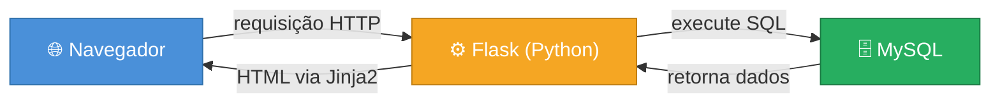
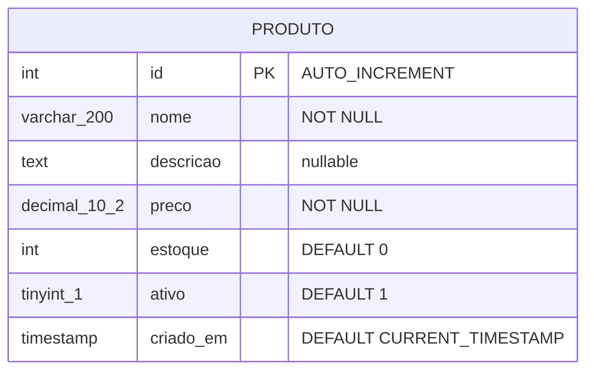
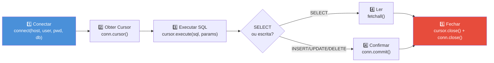

# Aula 05 — Conexão MySQL e Python

> **Disciplina:** Programação para Internet (ILP951)  
> **Professor:** Ronan Adriel Zenatti  
> **Pré-requisitos:** Aula 04 concluída — formulários GET/POST funcionando, padrão PRG aplicado.

---

## 🗺️ O que você vai aprender nesta aula

Até aqui, todos os dados do sistema existiam apenas enquanto a aplicação estava rodando — listas Python que desapareciam ao reiniciar o servidor. Hoje isso muda permanentemente. Você vai instalar e configurar o MySQL, entender como bancos de dados relacionais funcionam e por que são a escolha certa para sistemas web, conectar o Python ao banco usando a biblioteca `mysql-connector-python`, criar a primeira tabela via script Python, e executar os primeiros comandos SQL diretamente do código. Ao final desta aula, os dados cadastrados pelo seu sistema sobreviverão a qualquer reinicialização do servidor — pela primeira vez, sua aplicação terá memória permanente.

---

## Parte 1 — Persistência de dados: o problema que o banco resolve

### Dados voláteis versus dados persistentes

Quando o servidor Flask é encerrado — seja porque você fechou o terminal, o computador foi reiniciado, ou houve uma queda de energia — toda informação armazenada em variáveis Python simplesmente desaparece. Isso é chamado de **dado volátil**: existe apenas enquanto o programa está em execução na memória RAM. Para desenvolvimento e testes é aceitável, mas para um sistema real é inviável. Imagine um sistema de vendas que perde todos os pedidos cada vez que o servidor é reiniciado.

A solução profissional é gravar os dados em um **sistema de armazenamento persistente** que mantém as informações independentemente do estado do servidor. Arquivos de texto são uma opção simples, mas ineficientes para buscas e completamente inadequados para múltiplos usuários simultâneos. A solução correta para sistemas web é o **banco de dados relacional**.

[Ilustração educacional comparando dois painéis lado a lado. Painel esquerdo "Sem banco de dados": servidor Flask representado como bloco laranja com variáveis Python (blocos coloridos) na RAM. Um raio vermelho derruba o servidor e os blocos somem com rótulo "Dados perdidos ao reiniciar". Painel direito "Com MySQL": servidor Flask conectado por seta azul a um cilindro verde rotulado "MySQL — dados persistentes — sobrevivem ao reinício". Fundo branco, flat design educacional, paleta laranja e verde, legendas em português.]


### O que é um banco de dados relacional

Um **banco de dados relacional** organiza os dados em **tabelas** — estruturas bidimensionais compostas por linhas (registros) e colunas (atributos). As tabelas se relacionam entre si por meio de **chaves**, permitindo consultas que cruzam dados de múltiplas fontes com eficiência. Toda essa estrutura é governada pela linguagem **SQL** (Structured Query Language), criada nos anos 1970 e ainda hoje o padrão universal para bancos de dados.

A analogia mais próxima de uma tabela de banco de dados é uma planilha Excel: cada aba seria uma tabela, cada linha seria um registro (um produto, um cliente), e cada coluna seria um atributo (nome, preço, data). A diferença fundamental está em quatro capacidades: **integridade** (o banco garante que os dados seguem as regras definidas), **relacionamentos** (tabelas se conectam por chaves), **concorrência** (múltiplos usuários acessam e modificam dados simultaneamente sem conflito), e **performance** (consultas complexas em milhões de registros em milissegundos).

### Onde o MySQL se encaixa na arquitetura

O MySQL se posiciona como a camada de persistência que sustenta o servidor Flask. O diagrama abaixo mostra exatamente como os três componentes se comunicam:



O Flask atua como intermediário: recebe a requisição do navegador, consulta o MySQL, e usa os dados retornados para renderizar o HTML via Jinja2. O navegador nunca se comunica diretamente com o banco — toda interação passa pelo código Python.

---

## Parte 2 — Tipos de dados SQL essenciais

Antes de criar a primeira tabela, é fundamental entender os tipos de dados disponíveis no MySQL, pois cada coluna deve ter um tipo declarado. Isso garante integridade e permite ao banco otimizar armazenamento e consultas.

Para texto curto (nomes, e-mails, títulos) usa-se `VARCHAR(n)`, onde `n` é o tamanho máximo em caracteres — por exemplo, `VARCHAR(200)` para um nome de produto. Para textos longos sem limite fixo (descrições, conteúdo de artigos) usa-se `TEXT`. Para números inteiros (quantidades, IDs, idades) usa-se `INT`. Para valores decimais com precisão controlada (preços, medidas) usa-se `DECIMAL(p, d)`, onde `p` é o total de dígitos e `d` quantos ficam após a vírgula — `DECIMAL(10, 2)` suporta valores como `99999999.99`. Para valores verdadeiro/falso usa-se `TINYINT(1)`, onde `1` significa verdadeiro e `0` significa falso. Para datas e horas usa-se `DATE`, `DATETIME` ou `TIMESTAMP` — este último pode ser preenchido automaticamente com a data e hora atuais.

O diagrama de entidade abaixo mostra a estrutura que vamos criar:



O campo `id` com `AUTO_INCREMENT` e `PRIMARY KEY` é especial: o banco gera automaticamente um número único para cada novo registro, garantindo que nenhum produto tenha o mesmo ID jamais.

---

## Parte 3 — Instalando e configurando o MySQL

### Instalação do MySQL Community Server

Acesse **dev.mysql.com/downloads/mysql** e baixe o **MySQL Community Server** para Windows. Durante a instalação, selecione a opção **"Developer Default"** para instalar o servidor, o **MySQL Workbench** (interface gráfica), o shell e os conectores em um único processo.

Na tela de configuração de senha, defina uma senha para o usuário `root`. **Anote essa senha em um lugar seguro** — ela será necessária em todos os momentos que você precisar conectar ao banco. Mantenha a porta padrão **3306** sem alteração.

Após a instalação, abra um novo terminal e verifique:

```
mysql --version
```

A resposta esperada é algo como `mysql  Ver 8.0.xx for Win64`. Se o comando não for reconhecido, execute pelo MySQL Command Line Client instalado no menu Iniciar.

### MySQL Workbench

O **MySQL Workbench** é a ferramenta gráfica oficial para administrar instâncias MySQL. Com ele você cria bancos e tabelas, escreve e executa queries SQL, e visualiza dados em grade sem precisar usar o terminal. Abra o Workbench, clique em **"Local instance MySQL80"** e insira a senha do `root` quando solicitado.

[Captura de tela ilustrativa do MySQL Workbench mostrando a tela inicial com a conexão "Local instance MySQL80" destacada por um retângulo vermelho e seta com rótulo "Clique aqui para conectar". O painel do Workbench ao fundo mostra o Navigator à esquerda com "SCHEMAS" expandido e o editor SQL à direita com a barra de ferramentas. Estilo screenshot educacional realista.]


### Criando o banco de dados do projeto

No Workbench, abra um novo editor SQL (ícone de folha com raio) e execute o seguinte código com `Ctrl+Enter`:

```sql
-- Cria o banco de dados do projeto
-- IF NOT EXISTS: não gera erro se o banco já existir
CREATE DATABASE IF NOT EXISTS projeto_web
    CHARACTER SET utf8mb4
    COLLATE utf8mb4_unicode_ci;
-- CHARACTER SET utf8mb4: suporte completo a acentos, cedilha e emojis
-- COLLATE utf8mb4_unicode_ci: ordenação case-insensitive (João = joão)

-- Seleciona o banco para uso nas próximas queries
USE projeto_web;
```

O banco `projeto_web` deve aparecer no painel Navigator. Clique com o botão direito nele e selecione **"Set as Default Schema"** para que o Workbench o utilize automaticamente.

---

## Parte 4 — Conectando Python ao MySQL

### Instalando o conector

Com o ambiente virtual ativo, instale a biblioteca oficial:

```
pip install mysql-connector-python
pip freeze > requirements.txt
```

### O ciclo de vida de uma conexão

Toda operação com banco de dados em Python segue o mesmo ciclo de cinco etapas. Entender esse ciclo é essencial para evitar os dois erros mais comuns: esquecer de fechar a conexão (o que esgota o pool de conexões do banco) e esquecer de chamar `commit()` após operações de escrita (o que faz os dados parecerem salvos mas não estarem).



O **cursor** é o objeto que executa as queries SQL — pense nele como um ponteiro que navega pelos resultados de um `SELECT` ou confirma a execução de um `INSERT`. Sempre abra o cursor, use-o, e feche tanto o cursor quanto a conexão, preferencialmente usando `try/finally` para garantir o fechamento mesmo em caso de erro.

### Exemplo prático 1 — Script de setup do banco

Crie o arquivo `db_setup.py` na raiz do projeto. Este script será executado **uma única vez** para criar a estrutura inicial e inserir dados de exemplo:

```python
# db_setup.py — Script de configuração inicial do banco de dados
# Execute com: python db_setup.py
# Cria a tabela e insere dados de exemplo para testes.

import mysql.connector
from mysql.connector import Error

CONFIGURACAO = {
    'host':     'localhost',
    'user':     'root',
    'password': 'SUA_SENHA_AQUI',  # substitua pela sua senha do MySQL
    'database': 'projeto_web',
    'charset':  'utf8mb4'
}

try:
    # Passo 1: estabelece a conexão
    conn = mysql.connector.connect(**CONFIGURACAO)
    # O ** "desempacota" o dicionário como argumentos nomeados
    cursor = conn.cursor()
    print('✅ Conectado ao MySQL com sucesso!')

    # Passo 2: cria a tabela de produtos
    cursor.execute('''
        CREATE TABLE IF NOT EXISTS produto (
            id         INT            AUTO_INCREMENT PRIMARY KEY,
            nome       VARCHAR(200)   NOT NULL,
            descricao  TEXT,
            preco      DECIMAL(10, 2) NOT NULL,
            estoque    INT            NOT NULL DEFAULT 0,
            ativo      TINYINT(1)     NOT NULL DEFAULT 1,
            criado_em  TIMESTAMP      DEFAULT CURRENT_TIMESTAMP
        ) CHARACTER SET utf8mb4 COLLATE utf8mb4_unicode_ci
    ''')
    # AUTO_INCREMENT: MySQL gera o id automaticamente (1, 2, 3, ...)
    # NOT NULL: campo obrigatório — INSERT sem esse campo gera erro
    # DEFAULT 0: valor padrão quando o campo não é informado no INSERT
    # DECIMAL(10,2): até 10 dígitos no total, 2 após a vírgula (ideal para preço)
    # TIMESTAMP DEFAULT CURRENT_TIMESTAMP: preenchido automaticamente

    conn.commit()
    print('✅ Tabela "produto" criada (ou já existia).')

    # Passo 3: insere dados de exemplo apenas se a tabela estiver vazia
    cursor.execute('SELECT COUNT(*) FROM produto')
    total_existente = cursor.fetchone()[0]
    # fetchone() retorna a próxima linha do resultado como tupla; [0] pega o valor

    if total_existente == 0:
        produtos_exemplo = [
            ('Notebook Dell Inspiron',    'i5, 8GB RAM, 256GB SSD',         3499.90, 15),
            ('Mouse Logitech MX Master',  'Sem fio ergonômico, 7 botões',    299.90, 42),
            ('Teclado Mecânico Redragon', 'Switches Red, retroiluminado',    189.90,  3),
            ('Monitor LG 24"',            'Full HD, 75Hz, painel IPS',      1199.90,  0),
            ('Headset HyperX Cloud',      'Som surround 7.1, microfone',     349.90, 27),
        ]
        cursor.executemany(
            'INSERT INTO produto (nome, descricao, preco, estoque) VALUES (%s, %s, %s, %s)',
            produtos_exemplo
        )
        # executemany: insere múltiplos registros com eficiência
        # %s são placeholders — NUNCA use f-strings ou concatenação em SQL
        # O conector trata cada %s como dado puro, nunca como código SQL
        conn.commit()
        print(f'✅ {len(produtos_exemplo)} produtos inseridos.')
    else:
        print(f'ℹ️  Tabela já contém {total_existente} registro(s).')

except Error as e:
    print(f'❌ Erro MySQL: {e}')
    print('   Verifique: senha correta? MySQL rodando? Banco "projeto_web" criado?')

finally:
    # finally SEMPRE executa — garante que a conexão seja fechada mesmo com erro
    if 'cursor' in locals() and cursor:
        cursor.close()
    if 'conn' in locals() and conn.is_connected():
        conn.close()
    print('🔌 Conexão encerrada.')
```

Execute no terminal:

```
python db_setup.py
```

Você deve ver as mensagens de confirmação. No Workbench, clique com o botão direito em `produto` → **"Select Rows"**: os cinco produtos aparecem. Reinicie o servidor, desligue o computador — os dados continuam lá.

[Captura de tela ilustrativa do MySQL Workbench mostrando o Navigator à esquerda com a árvore "projeto_web > Tables > produto" expandida. À direita, o resultado de SELECT exibido em grade com cinco linhas de produtos mostrando as colunas id, nome, descricao, preco, estoque, ativo, criado_em. Estilo screenshot educacional realista.]


---

## Parte 5 — Centralizando a conexão com db.py

Se as credenciais e a lógica de conexão estivessem repetidas em cada rota do `app.py`, para mudar a senha ou o banco você precisaria editar dezenas de lugares. Além disso, o código de cada rota ficaria poluído com detalhes de infraestrutura. A solução é criar um módulo dedicado `db.py` que encapsula tudo e expõe uma interface simples para o resto do sistema:

```python
# db.py — Módulo central de acesso ao banco de dados
# Qualquer arquivo que precise do banco importa apenas este módulo

import mysql.connector
from mysql.connector import Error

DB_CONFIG = {
    'host':     'localhost',
    'user':     'root',
    'password': 'SUA_SENHA_AQUI',
    'database': 'projeto_web',
    'charset':  'utf8mb4'
}


def get_connection():
    """Retorna uma conexão ativa com o banco. Levanta Exception em caso de falha."""
    try:
        return mysql.connector.connect(**DB_CONFIG)
    except Error as e:
        raise Exception(f'Não foi possível conectar ao banco: {e}')


def execute_query(sql, params=None, fetch=False):
    """
    Executa uma query SQL de forma segura.

    Parâmetros:
        sql    — string SQL com %s como placeholders
        params — tupla ou lista com os valores dos placeholders
        fetch  — True para SELECT (retorna lista de dicts); False para INSERT/UPDATE/DELETE

    Retorna:
        fetch=True  → lista de dicionários (cada linha = {'coluna': valor})
        fetch=False → número de linhas afetadas
    """
    conn = get_connection()
    try:
        # dictionary=True: cada linha retorna como dicionário — produto['nome'] em vez de produto[0]
        cursor = conn.cursor(dictionary=True)
        cursor.execute(sql, params or ())

        if fetch:
            return cursor.fetchall()   # retorna todas as linhas
        else:
            conn.commit()              # confirma a transação
            return cursor.rowcount     # número de linhas afetadas

    except Error as e:
        conn.rollback()  # desfaz alterações parciais em caso de erro
        raise Exception(f'Erro ao executar query: {e}')
    finally:
        cursor.close()
        conn.close()


def execute_one(sql, params=None):
    """
    Executa um SELECT e retorna apenas a primeira linha (ou None).
    Útil para buscar um registro por ID.
    """
    resultados = execute_query(sql, params, fetch=True)
    return resultados[0] if resultados else None
```

[Diagrama educacional mostrando a arquitetura em camadas do projeto. Três caixas empilhadas verticalmente. Caixa superior "app.py — Rotas / Controllers" com fundo laranja: contém "from db import execute_query" e chamadas de função. Seta para baixo rotulada "importa e chama". Caixa do meio "db.py — Camada de Acesso ao Banco" com fundo azul: contém "execute_query()", "execute_one()", "get_connection()". Seta para baixo rotulada "usa conector". Caixa inferior "MySQL — projeto_web" com fundo verde: cilindro de banco com tabelas. Fundo branco, flat design, setas com rótulos de fluxo de dados, legendas em português.]


Com `db.py` pronto, o `app.py` para listar produtos fica assim:

```python
from flask import Flask, render_template, flash
from db import execute_query

app = Flask(__name__)
app.secret_key = 'chave-secreta-fatec-2026'


@app.route('/produtos')
def lista_produtos():
    try:
        # Toda a complexidade de conexão está em execute_query
        # O app.py só precisa saber o SQL e o que fazer com os dados
        produtos = execute_query(
            'SELECT * FROM produto WHERE ativo = 1 ORDER BY nome',
            fetch=True
        )
    except Exception as e:
        flash(f'Erro ao carregar produtos: {e}', 'danger')
        produtos = []

    return render_template('produtos.html', produtos=produtos, total=len(produtos))
```

---

## Parte 6 — SQL fundamental no Workbench

Antes de avançar para o CRUD completo, é essencial dominar os comandos SQL que o Python vai executar por baixo dos panos. Execute cada bloco no Workbench para entender o resultado antes de abstraí-lo em Python:

```sql
-- ═══ SELECT ═══════════════════════════════════════════════════════
SELECT * FROM produto;
SELECT nome, preco, estoque FROM produto ORDER BY preco DESC;
SELECT * FROM produto WHERE estoque = 0;
SELECT * FROM produto WHERE preco BETWEEN 200 AND 500;

-- LIKE com % busca texto em qualquer posição
SELECT * FROM produto WHERE nome LIKE '%mouse%';

-- Funções de agregação
SELECT COUNT(*)             AS total    FROM produto;
SELECT ROUND(AVG(preco), 2) AS media    FROM produto;
SELECT SUM(estoque)         AS estoque_total FROM produto;


-- ═══ INSERT ════════════════════════════════════════════════════════
INSERT INTO produto (nome, descricao, preco, estoque)
VALUES ('Webcam Logitech C920', 'Full HD 1080p, microfone duplo', 449.90, 18);


-- ═══ UPDATE ════════════════════════════════════════════════════════
-- ATENÇÃO: sem WHERE o UPDATE afeta TODOS os registros!
UPDATE produto SET estoque = 10 WHERE id = 4;
UPDATE produto SET ativo   = 0  WHERE estoque = 0;


-- ═══ DELETE ════════════════════════════════════════════════════════
-- ATENÇÃO: sem WHERE o DELETE apaga TODOS os registros!
-- Sempre use WHERE com id específico:
DELETE FROM produto WHERE id = 99;
```

Cada um desses comandos SQL tem um equivalente direto em Python via `execute_query`. Praticar no Workbench antes de codificar no Python é uma estratégia fundamental: você vê o resultado imediatamente, sem a variável do código Python adicionando complexidade ao diagnóstico.

---

## Parte 7 — SQL Injection: o risco que você precisa conhecer desde o início

**SQL Injection** é a vulnerabilidade de segurança mais comum em sistemas web e uma das mais destrutivas. Ela ocorre quando dados do usuário são inseridos diretamente em uma string SQL por concatenação, permitindo que um atacante manipule a query:

```python
# ❌ CÓDIGO VULNERÁVEL — NUNCA faça isso
usuario = request.form['usuario']
sql = f"SELECT * FROM usuario WHERE login='{usuario}'"
cursor.execute(sql)
# Se o atacante digitar: ' OR '1'='1' --
# A query vira: SELECT * FROM usuario WHERE login='' OR '1'='1' --
# Como '1'='1' é sempre verdadeiro, TODOS os usuários são retornados
```

Variantes mais agressivas usam `'; DROP TABLE usuario; --` para destruir tabelas inteiras com um único envio de formulário.

[Diagrama educacional mostrando SQL Injection em dois caminhos paralelos. Topo: formulário com campo "Usuário" contendo "' OR '1'='1' --". Caminho vermelho à esquerda "Servidor Vulnerável": concatenação direta, query resultante com parte injetada destacada em vermelho, resultado "Login concedido sem senha ⚠️". Caminho verde à direita "Servidor Seguro": placeholder %s, rótulo "dado tratado como texto puro", resultado "Login negado corretamente ✓". Fundo branco, flat design, contraste vermelho e verde, legendas em português.]


A solução é simples e inviolável: **sempre use queries parametrizadas com placeholders `%s`**. O conector MySQL trata os valores passados como dados puros — nunca os interpreta como código SQL:

```python
# ✅ CÓDIGO SEGURO — sempre assim, sem exceção
sql = "SELECT * FROM usuario WHERE login = %s AND senha = %s"
cursor.execute(sql, (usuario, senha))
# Mesmo que usuario contenha ' OR '1'='1', ele será tratado como texto literal
```

Esta é a regra mais importante desta aula: **jamais concatene dados do usuário em strings SQL**.

---

## Atividade da Aula

Crie o `db_setup.py` adaptado para o domínio do seu sistema (produtos, livros, clientes, consultas, filmes — o que você escolheu). Defina a tabela principal com pelo menos seis colunas de tipos variados: `INT AUTO_INCREMENT PRIMARY KEY`, `VARCHAR(n)`, `TEXT`, `DECIMAL(10,2)`, `TINYINT(1)` e `TIMESTAMP DEFAULT CURRENT_TIMESTAMP`. Insira pelo menos cinco registros de exemplo representativos. Execute o script e confirme no Workbench. Crie o `db.py` com `execute_query` e `execute_one`. Atualize a rota de listagem no `app.py` para buscar dados do MySQL em vez da lista estática.

```
git add .
git commit -m "Aula 05: MySQL conectado, tabela criada, listagem via banco real"
git push
```

---

## Resumo da Aula

Hoje você conectou o Python ao mundo da persistência. Instalou e configurou o MySQL, criou o banco `projeto_web` e a tabela principal via script Python com `executemany`. Aprendeu o ciclo de vida de uma conexão (conectar → cursor → executar → commit/fetchall → fechar) e por que o `finally` é essencial. Criou o módulo `db.py` que centraliza a conexão e expõe `execute_query` e `execute_one`, e usou essas funções para substituir os dados estáticos por dados reais do banco. Aprendeu o que é SQL Injection, como funciona e por que placeholders `%s` eliminam completamente o risco.

[Mapa mental educacional com "Aula 05" no centro em círculo verde escuro. Quatro ramos. Ramo azul "MySQL": "Community Server + Workbench", "Criar banco com utf8mb4", "Tipos: VARCHAR, TEXT, DECIMAL, TINYINT". Ramo verde "SQL Básico": "CREATE TABLE com tipos e constraints", "INSERT INTO com executemany", "SELECT com WHERE, ORDER BY, LIKE", "UPDATE e DELETE com WHERE". Ramo laranja "Python + MySQL": "pip install mysql-connector-python", "connect() → cursor() → execute()", "fetchall() / commit() / rollback()", "db.py centralizado". Ramo vermelho "Segurança": "SQL Injection: nunca concatenar", "Usar %s placeholders sempre", "Dados do usuário nunca viram código SQL". Fundo branco, flat design, ícones em cada ramo, legendas em português.]


Na próxima aula, o CRUD começa de verdade: você vai construir o **Create** conectando o formulário da Aula 04 diretamente ao `INSERT INTO`, e o **Read** completo com filtros dinâmicos usando `WHERE 1=1` e `LIKE`. Metade do sistema ficará funcional de ponta a ponta.

---

## Referências e Leitura Complementar

A documentação oficial do `mysql-connector-python` está em `dev.mysql.com/doc/connector-python/en`. O manual completo do MySQL 8.0 com todas as funções SQL está em `dev.mysql.com/doc/refman/8.0`. O guia definitivo sobre SQL Injection do OWASP está em `owasp.org/www-community/attacks/SQL_Injection`.

---

> ⬅️ [Aula anterior: Formulários e HTTP](Aula_04_Formularios_e_HTTP.md) | ➡️ [Próxima Aula: CRUD — Inserção e Leitura](Aula_06_CRUD_Insercao_e_Leitura.md)
