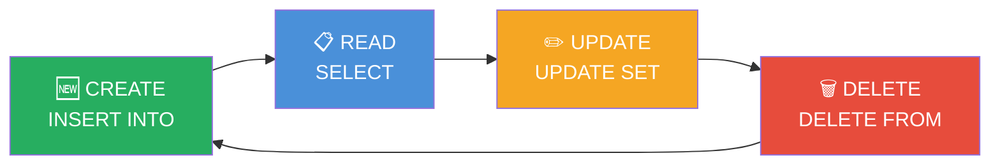
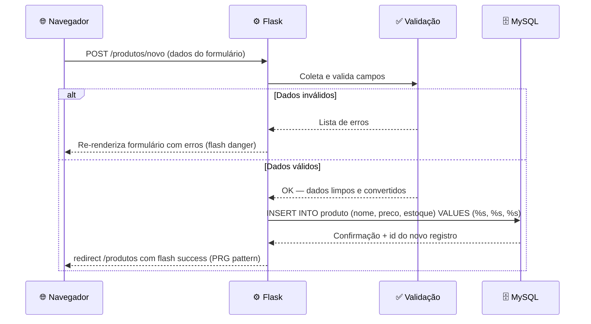

# Aula 06 — CRUD: Inserção e Leitura

> **Disciplina:** Programação para Internet (ILP951)  
> **Professor:** Ronan Adriel Zenatti  
> **Pré-requisitos:** Aula 05 concluída — MySQL instalado, `db.py` criado, tabela principal existindo no banco.

---

## 🗺️ O que você vai aprender nesta aula

Com a conexão ao banco estabelecida, chegou o momento de construir as duas primeiras operações do CRUD: **Create** (criar registros) e **Read** (ler e exibir registros). Você vai conectar o formulário POST da Aula 04 diretamente ao banco MySQL, de forma que cada envio salve um novo registro de verdade. Vai construir a listagem completa com dados reais, adicionar busca e filtros dinâmicos com `WHERE 1=1`, e aprender a exibir os detalhes de um único registro por ID. Ao final desta aula, metade do CRUD estará funcionando de ponta a ponta — desde o formulário no navegador até o banco de dados e de volta para a tela.

---

## Parte 1 — O que é CRUD e por que é a base de tudo

**CRUD** é o acrônimo das quatro operações fundamentais de qualquer sistema que persiste dados. Toda aplicação que você já usou — redes sociais, sistemas bancários, e-commerces, sistemas de gestão — é, em essência, uma interface sofisticada para essas quatro operações sobre um ou mais bancos de dados. Entender CRUD não é apenas aprender quatro palavras: é entender a estrutura mental por trás de qualquer sistema de informação.



O **C (Create)** corresponde ao `INSERT INTO` do SQL — adicionar um novo registro. O **R (Read)** corresponde ao `SELECT` — buscar e exibir registros. O **U (Update)** corresponde ao `UPDATE SET` — modificar um registro existente. O **D (Delete)** corresponde ao `DELETE FROM` — remover um registro. Nesta aula, implementamos C e R. Na Aula 07, completamos com U e D.

---

## Parte 2 — Create: o fluxo completo antes do código

### Visualizando o fluxo antes de escrever

Antes de escrever uma linha de código, vale a pena visualizar o fluxo completo que ocorre quando o usuário preenche e envia o formulário de cadastro. Esse hábito — mapear o fluxo primeiro, codificar depois — economiza tempo e evita erros de lógica.



Esse diagrama de sequência descreve exatamente o que você vai codificar. Cada seta é uma operação no código. Ter essa visão antes de escrever ajuda a entender onde cada parte se encaixa e por que cada linha existe.

### Exemplo prático 1 — Rota Create completa

Adicione ao `app.py`:

```python
from flask import Flask, render_template, request, flash, redirect, url_for
from db import execute_query

app = Flask(__name__)
app.secret_key = 'chave-secreta-fatec-2026'


@app.route('/produtos/novo', methods=['GET', 'POST'])
def novo_produto():
    # methods=['GET', 'POST'] informa ao Flask que esta rota aceita AMBOS os métodos.
    # GET: exibe o formulário vazio (usuário chegou na página)
    # POST: processa os dados enviados (usuário clicou em "Salvar")

    if request.method == 'POST':

        # ── COLETA ────────────────────────────────────────────────────────────
        # .strip() remove espaços do início e fim — evita cadastros com "   " como nome
        nome        = request.form.get('nome', '').strip()
        descricao   = request.form.get('descricao', '').strip()
        preco_str   = request.form.get('preco', '').strip()
        estoque_str = request.form.get('estoque', '0').strip()

        # ── VALIDAÇÃO ─────────────────────────────────────────────────────────
        # Coleta TODOS os erros antes de exibir qualquer mensagem
        erros = []

        if not nome:
            erros.append('O nome do produto é obrigatório.')
        elif len(nome) < 3:
            erros.append('O nome deve ter ao menos 3 caracteres.')

        # Tenta converter a string de preço para float
        # request.form sempre retorna strings — a conversão é responsabilidade do Python
        try:
            preco = float(preco_str.replace(',', '.'))
            # replace(',', '.'): aceita tanto 29,90 quanto 29.90
            if preco <= 0:
                erros.append('O preço deve ser maior que zero.')
        except ValueError:
            # Se a conversão falhar (ex: usuário digitou "abc"), registra o erro
            erros.append('Digite um preço válido (ex: 29.90).')
            preco = 0

        try:
            estoque = int(estoque_str)
            if estoque < 0:
                erros.append('O estoque não pode ser negativo.')
        except ValueError:
            erros.append('O estoque deve ser um número inteiro.')
            estoque = 0

        # ── PROCESSAMENTO ─────────────────────────────────────────────────────
        if erros:
            # Há erros: exibe cada um como flash danger e re-renderiza o formulário
            for erro in erros:
                flash(erro, 'danger')
            # Passa de volta os dados já digitados para não forçar o usuário a redigitar
            return render_template('produto_form.html',
                                   nome=nome, descricao=descricao,
                                   preco=preco_str, estoque=estoque_str,
                                   acao='novo')

        # Todos os dados são válidos — persiste no banco
        try:
            execute_query(
                'INSERT INTO produto (nome, descricao, preco, estoque) VALUES (%s, %s, %s, %s)',
                (nome, descricao, preco, estoque)
                # Tupla de valores — cada %s recebe o valor correspondente
                # NUNCA use f-strings ou concatenação aqui: risco de SQL Injection
            )
            flash(f'Produto "{nome}" cadastrado com sucesso!', 'success')
            return redirect(url_for('lista_produtos'))
            # redirect + url_for = padrão PRG: evita reenvio ao pressionar F5

        except Exception as e:
            flash(f'Erro ao salvar no banco. Tente novamente.', 'danger')
            app.logger.error(f'Erro INSERT produto: {e}')
            return render_template('produto_form.html',
                                   nome=nome, descricao=descricao,
                                   preco=preco_str, estoque=estoque_str,
                                   acao='novo')

    # GET: exibe formulário vazio — nenhum dado pré-preenchido
    return render_template('produto_form.html', acao='novo')
```

Crie `templates/produto_form.html`. Note que este template usa `acao` para servir tanto o Create (novo) quanto o Update (editar) — evitando duplicação de código:

```html



  Novo ProdutoEditar Produto
  — Sistema



<div class="row justify-content-center">
  <div class="col-md-7">
    <div class="card shadow-sm">

      <div class="card-header bg-primary text-white d-flex justify-content-between align-items-center">
        <h4 class="mb-0">
          📦 Novo Produto✏️ Editar Produto
        </h4>
        <a href="{{ url_for('lista_produtos') }}" class="btn btn-sm btn-outline-light">
          ← Voltar à lista
        </a>
      </div>

      <div class="card-body">
        <form action="{{ url_for('novo_produto') }}" method="post">

          <div class="mb-3">
            <label for="nome" class="form-label">
              Nome <span class="text-danger">*</span>
            </label>
            <input type="text" class="form-control" id="nome" name="nome"
                   value="{{ nome | default('') }}"
                   required minlength="3"
                   placeholder="Ex: Notebook Dell Inspiron">
          </div>

          <div class="mb-3">
            <label for="descricao" class="form-label">Descrição</label>
            {# textarea não usa atributo value — o conteúdo fica entre as tags #}
            <textarea class="form-control" id="descricao" name="descricao"
                      rows="3" placeholder="Detalhes do produto...">{{ descricao | default('') }}</textarea>
          </div>

          <div class="row">
            <div class="col-md-6 mb-3">
              <label for="preco" class="form-label">
                Preço (R$) <span class="text-danger">*</span>
              </label>
              <input type="number" class="form-control" id="preco" name="preco"
                     value="{{ preco | default('') }}"
                     step="0.01" min="0.01" required
                     placeholder="0.00">
              {# step="0.01": permite casas decimais; min="0.01": não aceita zero ou negativo #}
            </div>
            <div class="col-md-6 mb-3">
              <label for="estoque" class="form-label">Estoque</label>
              <input type="number" class="form-control" id="estoque" name="estoque"
                     value="{{ estoque | default('0') }}"
                     min="0" step="1">
            </div>
          </div>

          <div class="d-flex gap-2 mt-2">
            <button type="submit" class="btn btn-primary">
              ✅ Salvar Produto💾 Atualizar
            </button>
            <a href="{{ url_for('lista_produtos') }}" class="btn btn-outline-secondary">
              ❌ Cancelar
            </a>
          </div>

        </form>
      </div>

    </div>
  </div>
</div>

```

[Captura de tela ilustrativa mostrando o formulário de cadastro de produto renderizado no navegador. Card branco centralizado com cabeçalho azul "📦 Novo Produto" e botão "← Voltar à lista". Dentro do card: campo "Nome" com placeholder "Ex: Notebook Dell Inspiron", campo "Descrição" como textarea com três linhas, e na mesma linha os campos "Preço (R$)" e "Estoque" lado a lado. Na parte inferior, botão azul "✅ Salvar Produto" e botão cinza "❌ Cancelar". Estilo screenshot educacional realista com Bootstrap.]


---

## Parte 3 — Read: listagem com filtros dinâmicos

### O truque do WHERE 1=1

A leitura é a operação mais frequente em qualquer sistema — executada muito mais vezes do que inserções, edições ou exclusões. Construir uma listagem robusta com filtros opcionais requer uma técnica específica: o **`WHERE 1=1`**.

O problema é que filtros são opcionais: às vezes o usuário quer buscar por nome, às vezes filtrar por status, às vezes os dois, às vezes nenhum. Se você escrever a cláusula `WHERE` de forma fixa, não consegue adicionar condições de forma condicional. O `WHERE 1=1` resolve isso: como `1=1` é sempre verdadeiro, ele não filtra nada por si só, mas permite adicionar `AND condicao` quantas vezes forem necessárias sem se preocupar se é o primeiro filtro ou o décimo.

```python
@app.route('/produtos')
def lista_produtos():
    busca  = request.args.get('busca', '').strip()
    filtro = request.args.get('filtro', 'todos')

    # Começa com WHERE 1=1 — não filtra nada ainda, mas permite adicionar ANDs
    sql    = 'SELECT * FROM produto WHERE 1=1'
    params = []

    if busca:
        # LIKE '%termo%': busca o termo em qualquer posição do nome
        sql += ' AND nome LIKE %s'
        params.append(f'%{busca}%')

    if filtro == 'ativos':
        sql += ' AND ativo = 1'
    elif filtro == 'inativos':
        sql += ' AND ativo = 0'
    elif filtro == 'sem_estoque':
        sql += ' AND estoque = 0'

    sql += ' ORDER BY nome'

    try:
        produtos = execute_query(sql, params if params else None, fetch=True)
    except Exception as e:
        flash(f'Erro ao buscar produtos: {e}', 'danger')
        produtos = []

    return render_template('produtos.html',
                           produtos=produtos,
                           total=len(produtos),
                           busca=busca,
                           filtro=filtro)
```

[Diagrama educacional mostrando o funcionamento do WHERE 1=1 com três cenários lado a lado. Cenário 1 "Sem filtros": query resultante "SELECT * FROM produto WHERE 1=1 ORDER BY nome" — retorna tudo. Cenário 2 "Com busca": query "SELECT * FROM produto WHERE 1=1 AND nome LIKE '%mouse%' ORDER BY nome". Cenário 3 "Com busca + filtro": query completa com dois ANDs. Em cada cenário, blocos coloridos mostram quais partes da query são fixas (cinza) e quais são adicionadas condicionalmente (verde). Fundo branco, flat design educacional, legendas em português.]


### Template de listagem completo

Atualize (ou crie) `templates/produtos.html`:

```html

Produtos — Sistema



<div class="d-flex justify-content-between align-items-center mb-3">
  <h2>📦 Produtos</h2>
  <a href="{{ url_for('novo_produto') }}" class="btn btn-success">
    ➕ Novo Produto
  </a>
</div>

{# ── Barra de filtros com GET ─────────────────────────────────────── #}
<form action="{{ url_for('lista_produtos') }}" method="get"
      class="row g-2 mb-4 p-3 bg-light rounded border">
  <div class="col-md-5">
    <input type="search" class="form-control" name="busca"
           placeholder="🔍 Buscar por nome..." value="{{ busca }}">
  </div>
  <div class="col-md-4">
    <select class="form-select" name="filtro">
      <option value="todos"       selected>Todos</option>
      <option value="ativos"      selected>Ativos</option>
      <option value="inativos"    selected>Inativos</option>
      <option value="sem_estoque" selected>Sem estoque</option>
    </select>
  </div>
  <div class="col-md-3 d-flex gap-2">
    <button type="submit" class="btn btn-primary w-100">Filtrar</button>
    {# Link para limpar todos os filtros: volta para a URL base sem parâmetros #}
    <a href="{{ url_for('lista_produtos') }}" class="btn btn-outline-secondary" title="Limpar filtros">✕</a>
  </div>
</form>

<p class="text-muted small mb-2">{{ total }} produto(s) encontrado(s)</p>

{# ── Tabela de resultados ─────────────────────────────────────────── #}
<div class="table-responsive">
  <table class="table table-bordered table-hover align-middle">
    <thead class="table-dark">
      <tr>
        <th style="width:50px">#</th>
        <th>Nome</th>
        <th style="width:120px">Preço</th>
        <th style="width:100px" class="text-center">Estoque</th>
        <th style="width:90px"  class="text-center">Status</th>
        <th style="width:80px"  class="text-center">Ações</th>
      </tr>
    </thead>
    <tbody>
      
      <tr>
        <td class="text-muted small">{{ p.id }}</td>
        <td>
          <strong>{{ p.nome }}</strong>
          
            <br><small class="text-muted">{{ p.descricao | truncate(60) }}</small>
          
        </td>
        <td class="fw-bold text-success">R$ {{ "%.2f" | format(p.preco) }}</td>
        <td class="text-center">
          
            <span class="badge bg-danger">Esgotado</span>
          
            <span class="badge bg-warning text-dark">{{ p.estoque }} ⚠️</span>
          
            <span class="badge bg-success">{{ p.estoque }}</span>
          
        </td>
        <td class="text-center">
          
            <span class="badge bg-success">Ativo</span>
          
            <span class="badge bg-secondary">Inativo</span>
          
        </td>
        <td class="text-center">
          {# Botão para ver o detalhe completo do produto #}
          <a href="{{ url_for('detalhe_produto', id=p.id) }}"
             class="btn btn-sm btn-outline-primary" title="Ver detalhe">👁️</a>
        </td>
      </tr>
      
      <tr>
        <td colspan="6" class="text-center text-muted py-5">
          <div class="fs-4 mb-2">📭</div>
          Nenhum produto encontrado com os filtros aplicados.
          <a href="{{ url_for('lista_produtos') }}">Limpar filtros</a>
        </td>
      </tr>
      
    </tbody>
  </table>
</div>


```

---

## Parte 4 — Read: detalhe de um único registro

Além da listagem, todo sistema precisa de uma página de detalhe que exibe todas as informações de um único item, acessível por seu ID na URL:

```python
@app.route('/produtos/<int:id>')
def detalhe_produto(id):
    # int:id garante que apenas números inteiros funcionam
    # /produtos/abc retorna 404 automaticamente
    try:
        # execute_one retorna um dicionário ou None se não encontrar
        produto = execute_one(
            'SELECT * FROM produto WHERE id = %s',
            (id,)
            # (id,) é uma tupla de um elemento — o vírgula é obrigatório
        )
    except Exception as e:
        flash(f'Erro ao buscar produto: {e}', 'danger')
        return redirect(url_for('lista_produtos'))

    if not produto:
        # Se o id não existe no banco, redireciona com aviso
        flash(f'Produto com ID {id} não encontrado.', 'warning')
        return redirect(url_for('lista_produtos'))

    return render_template('produto_detalhe.html', produto=produto)
```

Lembre-se de importar `execute_one` no topo do `app.py`:

```python
from db import execute_query, execute_one
```

Crie `templates/produto_detalhe.html`:

```html

{{ produto.nome }} — Detalhe


<div class="row justify-content-center">
  <div class="col-md-7">
    <div class="card shadow-sm">

      <div class="card-header d-flex justify-content-between align-items-center">
        <h4 class="mb-0">{{ produto.nome }}</h4>
        <a href="{{ url_for('lista_produtos') }}" class="btn btn-sm btn-outline-secondary">
          ← Lista
        </a>
      </div>

      <div class="card-body">
        
          <p class="lead text-muted">{{ produto.descricao }}</p>
          <hr>
        

        {# dl/dt/dd: lista de definição — estrutura semântica para pares chave/valor #}
        <dl class="row">
          <dt class="col-sm-4">ID</dt>
          <dd class="col-sm-8 text-muted">#{{ produto.id }}</dd>

          <dt class="col-sm-4">Preço</dt>
          <dd class="col-sm-8 fw-bold text-success fs-5">
            R$ {{ "%.2f" | format(produto.preco) }}
          </dd>

          <dt class="col-sm-4">Estoque</dt>
          <dd class="col-sm-8">
            
              <span class="badge bg-danger fs-6">Esgotado</span>
            
              <span class="badge bg-warning text-dark fs-6">{{ produto.estoque }} un. ⚠️</span>
            
              <span class="badge bg-success fs-6">{{ produto.estoque }} unidades</span>
            
          </dd>

          <dt class="col-sm-4">Status</dt>
          <dd class="col-sm-8">
            
              <span class="badge bg-success">Ativo</span>
            
              <span class="badge bg-secondary">Inativo</span>
            
          </dd>

          <dt class="col-sm-4">Cadastrado em</dt>
          <dd class="col-sm-8 text-muted small">{{ produto.criado_em }}</dd>
        </dl>
      </div>

      <div class="card-footer d-flex gap-2">
        <a href="{{ url_for('lista_produtos') }}" class="btn btn-outline-secondary">
          ← Lista
        </a>
        <a href="{{ url_for('novo_produto') }}" class="btn btn-success ms-auto">
          ➕ Novo Produto
        </a>
      </div>

    </div>
  </div>
</div>

```

[Captura de tela ilustrativa mostrando as duas telas do CRUD Read lado a lado. Esquerda: listagem com barra de filtros no topo cinza, tabela com cinco produtos, badges coloridos de estoque (verde, amarelo, vermelho) e status. Direita: página de detalhe de um produto com card mostrando nome, descrição em cinza, preço em verde grande, badge de estoque e data de cadastro. Fundo Bootstrap branco, estilo screenshot educacional realista.]


---

## Parte 5 — Tratamento de erros de banco

Sempre que uma operação de banco é executada, algo pode dar errado: conexão perdida, dado duplicado, violação de constraint. O padrão correto é envolver chamadas ao banco em `try/except`, usar `flash` para comunicar o problema ao usuário sem expor detalhes técnicos na tela, e registrar o erro real nos logs para diagnóstico:

```python
try:
    execute_query(
        'INSERT INTO produto (nome, preco) VALUES (%s, %s)',
        (nome, preco)
    )
    flash('Produto salvo com sucesso!', 'success')
    return redirect(url_for('lista_produtos'))

except Exception as e:
    # Para o usuário: mensagem amigável sem detalhes técnicos
    flash('Não foi possível salvar o produto. Tente novamente.', 'danger')
    # Para o desenvolvedor: log com o erro real para diagnóstico
    app.logger.error(f'Erro ao inserir produto: {e}')
    # Em vez de crash, retorna o formulário preenchido para o usuário tentar de novo
    return render_template('produto_form.html', nome=nome, preco=preco_str, acao='novo')
```

Essa separação é importante: o usuário não precisa — e não deve — ver mensagens como `mysql.connector.errors.IntegrityError: 1062 Duplicate entry`. Essa informação é para você, o desenvolvedor, não para ele.

---

## Atividade da Aula

Implemente o **Create** e o **Read** completos para a entidade principal do seu sistema. O Create deve ter formulário com validação no servidor, conversão de tipos (float para preço, int para quantidade), re-população do formulário em caso de erro, e redirecionamento PRG após sucesso. O Read deve ter listagem com ao menos um filtro funcional (busca por nome com `LIKE`), exibição de badges ou cores condicionais para algum atributo importante (estoque, status, nível), e página de detalhe acessível por `/<entidade>/<int:id>` com tratamento do caso "não encontrado". Teste o ciclo completo: inserir, listar, filtrar, buscar e ver o detalhe.

```
git add .
git commit -m "Aula 06: Create e Read funcionando com MySQL de ponta a ponta"
git push
```

---

## Resumo da Aula

Hoje o CRUD ganhou sua primeira metade. Você construiu o **Create** conectando o formulário diretamente ao `INSERT INTO`, com validação de tipos (float e int), tratamento de exceções de banco, re-população do formulário e padrão PRG. Construiu o **Read** em duas versões: listagem com filtros dinâmicos usando `WHERE 1=1` e `LIKE`, e detalhe individual por ID com `execute_one` e tratamento elegante do "não encontrado". Na próxima aula, você completa o ciclo com **Update** (editar) e **Delete** (excluir), tornando o sistema completamente funcional para o Trabalho 1.

---

## Referências e Leitura Complementar

O livro **Desenvolvimento Web com Flask** de Miguel Grinberg (Novatec) cobre CRUD com SQLAlchemy nos capítulos 5 e 6 — a abordagem com ORM é diferente da que usamos aqui com SQL puro, mas os conceitos de Create e Read são idênticos. A documentação do MySQL sobre `INSERT` e `SELECT` com todas as cláusulas disponíveis está em `dev.mysql.com/doc/refman/8.0/en/insert.html` e `dev.mysql.com/doc/refman/8.0/en/select.html`.

---

> ⬅️ [Aula anterior: Conexão MySQL e Python](Aula_05_Conexao_MySQL_e_Python.md) | ➡️ [Próxima Aula: CRUD — Edição e Exclusão](Aula_07_CRUD_Edicao_e_Exclusao.md)
