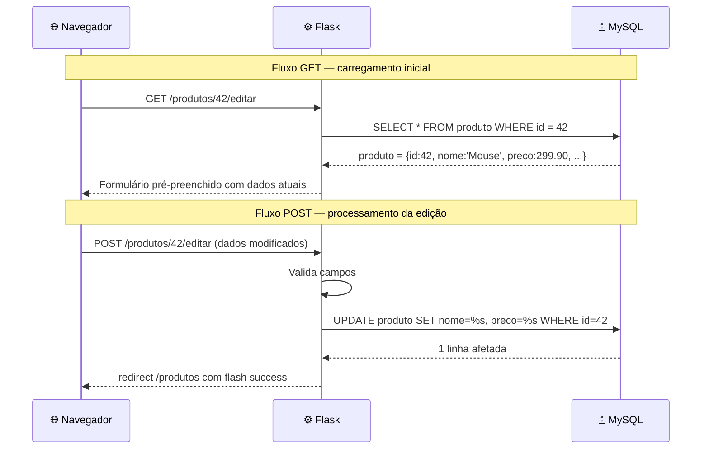
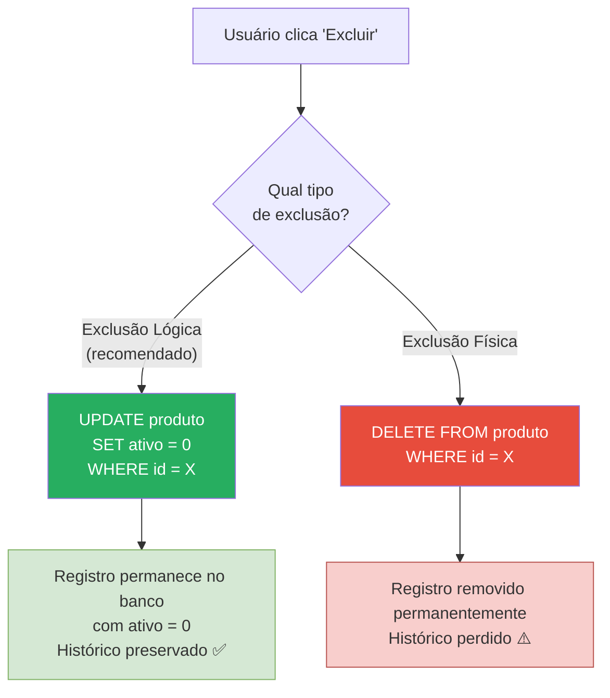
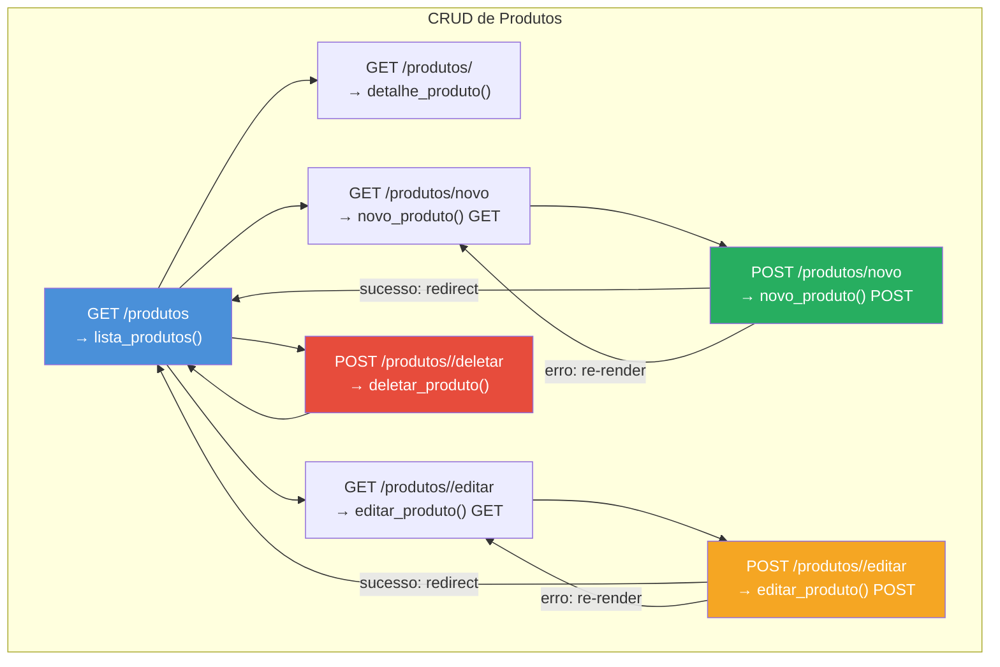

# Aula 07 — CRUD: Edição e Exclusão

> **Disciplina:** Programação para Internet (ILP951)  
> **Professor:** Ronan Adriel Zenatti  
> **Pré-requisitos:** Aula 06 concluída — Create e Read funcionando com MySQL, `execute_one` disponível no `db.py`.

---

## 🗺️ O que você vai aprender nesta aula

O CRUD estará completo hoje. Você vai implementar o **Update** — a capacidade de editar um registro existente — e o **Delete** — a capacidade de removê-lo. A edição traz desafios distintos do cadastro: é preciso carregar os dados atuais no formulário, garantir que o registro a ser editado realmente existe, e só atualizar os campos que o usuário modificou. A exclusão parece simples, mas exige cuidados específicos para evitar exclusões acidentais e proteger o sistema contra ataques. Ao final desta aula, o sistema terá persistência completa — criar, ler, editar e excluir — e você estará pronto para a entrega do Trabalho 1.

---

## Parte 1 — Update: o fluxo é diferente do Create

### Por que o Update é mais complexo

À primeira vista, o Update parece apenas um Create com dados pré-preenchidos. Mas há diferenças fundamentais que exigem tratamento específico.

No Create, o formulário sempre começa vazio. No Update, o formulário deve ser pré-preenchido com os valores atuais do banco — caso contrário, campos que o usuário não modificou chegariam vazios e sobrescreveriam os dados existentes com strings vazias.

No Create, há um único passo: exibir o formulário vazio (GET) e processar o envio (POST). No Update, há três passos: buscar o registro pelo ID (no GET), verificar que ele existe, e pré-preencher o formulário com seus valores atuais; depois processar o envio (POST) com validação e `UPDATE` no banco.

No Create, a URL é sempre a mesma: `/produtos/novo`. No Update, a URL inclui o ID do registro a ser editado: `/produtos/42/editar`.



### Exemplo prático 1 — Rota Update completa

Adicione ao `app.py`:

```python
@app.route('/produtos/<int:id>/editar', methods=['GET', 'POST'])
def editar_produto(id):
    # Antes de qualquer coisa: verifica que o produto existe no banco
    # Se não existir, redireciona com aviso em vez de mostrar formulário fantasma
    produto_atual = execute_one('SELECT * FROM produto WHERE id = %s', (id,))
    if not produto_atual:
        flash(f'Produto com ID {id} não encontrado.', 'warning')
        return redirect(url_for('lista_produtos'))

    if request.method == 'POST':

        # ── COLETA ────────────────────────────────────────────────────────────
        nome        = request.form.get('nome', '').strip()
        descricao   = request.form.get('descricao', '').strip()
        preco_str   = request.form.get('preco', '').strip()
        estoque_str = request.form.get('estoque', '0').strip()
        # ativo é um checkbox — se não estiver marcado, não aparece em request.form
        ativo       = 1 if request.form.get('ativo') else 0

        # ── VALIDAÇÃO ─────────────────────────────────────────────────────────
        erros = []

        if not nome:
            erros.append('O nome é obrigatório.')
        elif len(nome) < 3:
            erros.append('O nome deve ter ao menos 3 caracteres.')

        try:
            preco = float(preco_str.replace(',', '.'))
            if preco <= 0:
                erros.append('O preço deve ser maior que zero.')
        except ValueError:
            erros.append('Digite um preço válido.')
            preco = 0

        try:
            estoque = int(estoque_str)
            if estoque < 0:
                erros.append('O estoque não pode ser negativo.')
        except ValueError:
            erros.append('O estoque deve ser número inteiro.')
            estoque = 0

        if erros:
            for erro in erros:
                flash(erro, 'danger')
            # Re-renderiza com os dados que o usuário tentou enviar
            # Passa também produto_atual para ter o ID disponível no template
            return render_template('produto_form.html',
                                   produto=produto_atual,
                                   nome=nome, descricao=descricao,
                                   preco=preco_str, estoque=estoque_str,
                                   ativo=ativo, acao='editar')

        # ── ATUALIZAÇÃO NO BANCO ───────────────────────────────────────────────
        try:
            execute_query(
                '''UPDATE produto
                   SET nome = %s, descricao = %s, preco = %s,
                       estoque = %s, ativo = %s
                   WHERE id = %s''',
                (nome, descricao, preco, estoque, ativo, id)
                # SEMPRE inclua o WHERE com o id — sem WHERE, TODOS os registros seriam alterados
            )
            flash(f'Produto "{nome}" atualizado com sucesso!', 'success')
            return redirect(url_for('lista_produtos'))

        except Exception as e:
            flash('Erro ao atualizar. Tente novamente.', 'danger')
            app.logger.error(f'Erro UPDATE produto id={id}: {e}')
            return render_template('produto_form.html',
                                   produto=produto_atual,
                                   nome=nome, descricao=descricao,
                                   preco=preco_str, estoque=estoque_str,
                                   ativo=ativo, acao='editar')

    # ── GET: pré-preenche o formulário com os dados atuais do banco ───────────
    return render_template('produto_form.html',
                           produto=produto_atual,
                           nome=produto_atual['nome'],
                           descricao=produto_atual['descricao'] or '',
                           preco=produto_atual['preco'],
                           estoque=produto_atual['estoque'],
                           ativo=produto_atual['ativo'],
                           acao='editar')
```

### Atualizando o template produto_form.html para suportar edição

O template que criamos na Aula 06 já usa a variável `acao` para alternar entre "novo" e "editar". Precisamos fazer dois ajustes: o `action` do formulário deve mudar conforme a ação, e o campo de status (ativo/inativo) deve aparecer apenas na edição — na criação, o produto nasce ativo por padrão.

```html


  Novo ProdutoEditar Produto — Sistema



<div class="row justify-content-center">
  <div class="col-md-7">
    <div class="card shadow-sm">

      <div class="card-header bg-primary text-white d-flex justify-content-between align-items-center">
        <h4 class="mb-0">
          📦 Novo Produto✏️ Editar Produto #{{ produto.id }}
        </h4>
        <a href="{{ url_for('lista_produtos') }}" class="btn btn-sm btn-outline-light">← Lista</a>
      </div>

      <div class="card-body">

        {# action muda conforme a operação: novo usa novo_produto, editar usa editar_produto #}
        
          <form action="{{ url_for('novo_produto') }}" method="post">
        
          <form action="{{ url_for('editar_produto', id=produto.id) }}" method="post">
        

          <div class="mb-3">
            <label for="nome" class="form-label">Nome <span class="text-danger">*</span></label>
            <input type="text" class="form-control" id="nome" name="nome"
                   value="{{ nome | default('') }}" required minlength="3"
                   placeholder="Ex: Notebook Dell Inspiron">
          </div>

          <div class="mb-3">
            <label for="descricao" class="form-label">Descrição</label>
            <textarea class="form-control" id="descricao" name="descricao"
                      rows="3">{{ descricao | default('') }}</textarea>
          </div>

          <div class="row">
            <div class="col-md-6 mb-3">
              <label for="preco" class="form-label">Preço (R$) <span class="text-danger">*</span></label>
              <input type="number" class="form-control" id="preco" name="preco"
                     value="{{ preco | default('') }}" step="0.01" min="0.01" required>
            </div>
            <div class="col-md-6 mb-3">
              <label for="estoque" class="form-label">Estoque</label>
              <input type="number" class="form-control" id="estoque" name="estoque"
                     value="{{ estoque | default('0') }}" min="0" step="1">
            </div>
          </div>

          {# Campo de status: só exibido na edição — no create o produto nasce ativo #}
          
          <div class="mb-3 form-check form-switch">
            {# form-switch: toggle visual mais moderno que um checkbox padrão #}
            <input class="form-check-input" type="checkbox"
                   id="ativo" name="ativo" value="1"
                   checked>
            <label class="form-check-label" for="ativo">Produto ativo</label>
            <div class="form-text">Desmarque para desativar sem excluir do banco.</div>
          </div>
          

          <div class="d-flex gap-2 mt-3">
            <button type="submit" class="btn btn-primary">
              ✅ Salvar💾 Atualizar
            </button>
            <a href="{{ url_for('lista_produtos') }}" class="btn btn-outline-secondary">
              ❌ Cancelar
            </a>
          </div>

        </form>
      </div>
    </div>
  </div>
</div>

```

Adicione o botão de edição na tabela de listagem (`produtos.html`), na coluna de Ações, ao lado do botão de detalhe existente:

```html
{# Na célula de ações da tabela de produtos: #}
<td class="text-center">
  <a href="{{ url_for('detalhe_produto', id=p.id) }}"
     class="btn btn-sm btn-outline-primary" title="Ver detalhe">👁️</a>
  <a href="{{ url_for('editar_produto', id=p.id) }}"
     class="btn btn-sm btn-outline-warning" title="Editar">✏️</a>
</td>
```

[Captura de tela ilustrativa mostrando o formulário de edição de produto renderizado no navegador. Card branco com cabeçalho azul "✏️ Editar Produto #3" e botão "← Lista". Dentro do card: campo "Nome" pré-preenchido com "Teclado Mecânico Redragon", campo "Descrição" pré-preenchido, campos "Preço" e "Estoque" lado a lado com valores reais do banco, e um toggle switch "Produto ativo" marcado (diferente do formulário de criação, que não tem esse campo). Botões "💾 Atualizar" e "❌ Cancelar". Estilo screenshot educacional realista com Bootstrap.]


---

## Parte 2 — Exclusão lógica versus exclusão física

### Duas abordagens com consequências muito diferentes

Ao implementar o Delete, você enfrenta uma decisão arquitetural importante: **excluir fisicamente** o registro (removê-lo do banco com `DELETE FROM`) ou **excluir logicamente** (apenas marcar o campo `ativo = 0`, mantendo o registro no banco mas escondendo-o das listagens normais).

A exclusão física é simples e definitiva — o registro some para sempre. Mas causa problemas sérios em sistemas reais: um produto que teve vendas associadas a ele não pode ser deletado sem quebrar o histórico de vendas. Um cliente com pedidos registrados não pode ser removido sem comprometer a integridade referencial.

A exclusão lógica é a abordagem preferida em sistemas de produção porque preserva o histórico, permite recuperação ("desativar" e depois "reativar"), e evita problemas de integridade referencial. A tabela `produto` já tem o campo `ativo TINYINT(1)`, exatamente para isso.



Para este projeto, vamos implementar **ambas**: a exclusão lógica como operação padrão ("desativar") e a exclusão física como operação de emergência com confirmação explícita.

---

## Parte 3 — Protegendo o Delete contra ataques CSRF

### Por que o Delete nunca deve ser um link GET

Antes de escrever o código de exclusão, é fundamental entender um problema de segurança específico. Se você implementar a exclusão como um link simples:

```html
<!-- ❌ NUNCA faça assim -->
<a href="/produtos/42/deletar">🗑️ Excluir</a>
```

Qualquer pessoa pode enviar esse link por e-mail ou mensagem para um usuário autenticado. Quando o usuário clicar no link — talvez pensando que é outro tipo de conteúdo — o produto será excluído sem nenhuma confirmação. Isso é chamado de **CSRF (Cross-Site Request Forgery)** — um ataque que faz o navegador da vítima executar ações não intencionadas em um site no qual ela está autenticada.

A solução é fazer toda exclusão via **POST**, nunca via GET. Um link HTML sempre faz GET. Para fazer POST, você precisa de um formulário. A combinação de usar POST + pedir confirmação visual ao usuário é suficiente para o nível de proteção desta disciplina:

[Diagrama educacional comparando "Exclusão Insegura via GET" versus "Exclusão Segura via POST". Lado esquerdo vermelho: link HTML simples "href=/deletar/42", qualquer bot ou crawler pode seguir esse link automaticamente, nenhuma confirmação. Lado direito verde: formulário com method="post", botão de confirmação "Tem certeza?", o bot não consegue acionar porque formulários POST não são seguidos automaticamente. Fundo branco, flat design, paleta vermelho/verde educacional, legendas em português.]


### Exemplo prático 2 — Rota Delete com confirmação

```python
@app.route('/produtos/<int:id>/deletar', methods=['POST'])
def deletar_produto(id):
    # methods=['POST'] APENAS — tentativas de GET retornam 405 Method Not Allowed
    # Isso garante que a exclusão nunca seja acionada por um simples link ou crawler

    # Verifica que o produto existe antes de tentar deletar
    produto = execute_one('SELECT nome FROM produto WHERE id = %s', (id,))
    if not produto:
        flash(f'Produto ID {id} não encontrado.', 'warning')
        return redirect(url_for('lista_produtos'))

    # Captura o tipo de exclusão enviado pelo formulário
    tipo = request.form.get('tipo', 'logica')

    try:
        if tipo == 'fisica':
            # Exclusão física: remove o registro permanentemente
            # Use apenas em casos específicos — dados históricos serão perdidos
            execute_query('DELETE FROM produto WHERE id = %s', (id,))
            flash(f'Produto "{produto["nome"]}" excluído permanentemente.', 'info')
        else:
            # Exclusão lógica (padrão): marca como inativo — preserva o histórico
            execute_query('UPDATE produto SET ativo = 0 WHERE id = %s', (id,))
            flash(f'Produto "{produto["nome"]}" desativado com sucesso.', 'success')

        return redirect(url_for('lista_produtos'))

    except Exception as e:
        flash('Erro ao excluir produto. Tente novamente.', 'danger')
        app.logger.error(f'Erro ao deletar produto id={id}: {e}')
        return redirect(url_for('lista_produtos'))
```

O formulário de exclusão fica inline na tabela de produtos, no lugar do botão de exclusão. Adicione à coluna de Ações em `produtos.html`:

```html
{# Botão de exclusão com confirmação via modal Bootstrap #}
{# O data-bs-target aponta para o modal com o id do produto #}
<button class="btn btn-sm btn-outline-danger"
        data-bs-toggle="modal"
        data-bs-target="#modal-deletar-{{ p.id }}"
        title="Excluir">🗑️</button>

{# Modal de confirmação de exclusão — um para cada produto na lista #}
<div class="modal fade" id="modal-deletar-{{ p.id }}" tabindex="-1">
  <div class="modal-dialog modal-dialog-centered">
    <div class="modal-content">
      <div class="modal-header bg-danger text-white">
        <h5 class="modal-title">⚠️ Confirmar Exclusão</h5>
        <button type="button" class="btn-close btn-close-white" data-bs-dismiss="modal"></button>
      </div>
      <div class="modal-body">
        <p>Deseja desativar o produto <strong>{{ p.nome }}</strong>?</p>
        <p class="text-muted small">O produto será marcado como inativo e não aparecerá nas listagens, mas seus dados serão preservados.</p>
      </div>
      <div class="modal-footer">
        <button type="button" class="btn btn-secondary" data-bs-dismiss="modal">
          Cancelar
        </button>
        {# O formulário POST é a única forma segura de executar a exclusão #}
        <form action="{{ url_for('deletar_produto', id=p.id) }}" method="post" class="d-inline">
          <input type="hidden" name="tipo" value="logica">
          {# type="hidden": campo invisível para o usuário mas enviado no POST #}
          <button type="submit" class="btn btn-danger">
            🗑️ Desativar
          </button>
        </form>
      </div>
    </div>
  </div>
</div>
```

[Captura de tela ilustrativa mostrando o modal de confirmação de exclusão aberto sobre a listagem de produtos. O modal tem cabeçalho vermelho "⚠️ Confirmar Exclusão", corpo com o texto "Deseja desativar o produto Teclado Mecânico Redragon?" e texto secundário em cinza sobre preservação dos dados. Rodapé com botão cinza "Cancelar" e botão vermelho "🗑️ Desativar". O fundo da listagem está escurecido pelo overlay do modal. Estilo screenshot educacional realista com Bootstrap.]


---

## Parte 4 — O CRUD completo: visão geral das rotas

Com Create, Read, Update e Delete implementados, vale mapear todas as rotas do sistema e seus relacionamentos para ter uma visão completa antes da entrega:



Observe o padrão que se repete: formulários de GET exibem; POST com dados válidos redireciona para a listagem; POST com dados inválidos re-renderiza o formulário. Esse padrão é consistente em todo o sistema e é exatamente o que os avaliadores vão verificar na entrega do T1.

---

## Parte 5 — Soft delete e reativação

Como usamos exclusão lógica, é natural oferecer a operação inversa: **reativar** um produto que foi desativado. Isso demonstra ao usuário que os dados não foram perdidos — eles estão apenas ocultos.

Adicione esta rota ao `app.py`:

```python
@app.route('/produtos/<int:id>/reativar', methods=['POST'])
def reativar_produto(id):
    produto = execute_one('SELECT nome FROM produto WHERE id = %s', (id,))
    if not produto:
        flash('Produto não encontrado.', 'warning')
        return redirect(url_for('lista_produtos'))

    execute_query('UPDATE produto SET ativo = 1 WHERE id = %s', (id,))
    flash(f'Produto "{produto["nome"]}" reativado com sucesso!', 'success')
    return redirect(url_for('lista_produtos'))
```

Na listagem, quando o filtro está em "inativos", mostre o botão de reativação em vez do de exclusão:

```html

  {# Produto ativo: mostrar botão de desativar #}
  <button class="btn btn-sm btn-outline-danger"
          data-bs-toggle="modal"
          data-bs-target="#modal-deletar-{{ p.id }}">🗑️</button>

  {# Produto inativo: mostrar botão de reativar #}
  <form action="{{ url_for('reativar_produto', id=p.id) }}" method="post" class="d-inline">
    <button type="submit" class="btn btn-sm btn-outline-success" title="Reativar">
      ♻️
    </button>
  </form>

```

---

## Atividade da Aula

Complete o CRUD da entidade principal do seu sistema adicionando Update e Delete. O Update deve ter rota com `GET` para pré-carregar o formulário com dados do banco e `POST` para processar a atualização, com validação idêntica ao Create e tratamento de "não encontrado". O Delete deve ser exclusão lógica via POST com modal de confirmação Bootstrap — nunca um link GET. Implemente também a reativação. Teste o fluxo completo: criar um registro, editar um campo, desativá-lo, visualizá-lo no filtro "Inativos", e reativá-lo.

```
git add .
git commit -m "Aula 07: CRUD completo — Update e Delete implementados"
git push
```

---

## Resumo da Aula

O CRUD está completo. Você construiu o **Update** com o fluxo de três etapas (buscar → pré-preencher → processar POST), entendendo por que o formulário de edição é diferente do de criação. Implementou a diferença entre **exclusão lógica** (marcar `ativo = 0`) e **exclusão física** (`DELETE FROM`), e por que a lógica é preferida em sistemas reais. Protegeu o Delete contra ataques CSRF usando formulários POST com modal de confirmação. Mapeou todas as rotas do sistema em um diagrama coerente. E adicionou a reativação como complemento natural da exclusão lógica.

[Mapa mental educacional com "Aula 07" no centro em círculo laranja. Quatro ramos. Ramo verde "Update": "GET pré-preenche formulário", "POST valida e executa UPDATE SQL", "WHERE id obrigatório no SQL", "acao='editar' no template". Ramo vermelho "Delete": "Exclusão lógica: ativo=0", "Exclusão física: DELETE FROM", "Sempre via POST — nunca GET", "Modal de confirmação Bootstrap". Ramo azul "Segurança": "CSRF: formulários POST protegem", "links GET são vulneráveis", "hidden input para tipo de exclusão". Ramo roxo "Padrão CRUD": "Todas as rotas mapeadas", "GET exibe, POST processa", "Redirect após sucesso sempre". Fundo branco, flat design, ícone em cada ramo, legendas em português.]


Na próxima aula você vai preparar e entregar o **Trabalho 1 (T1)**, que consolida todo o conteúdo das Aulas 01 a 07: ambiente configurado, Flask com rotas e templates, Bootstrap responsivo, formulários com validação e MySQL com CRUD completo.

---

## Referências e Leitura Complementar

O conceito de CSRF e as melhores práticas de proteção estão documentados pelo OWASP em `owasp.org/www-community/attacks/csrf`. A documentação do Bootstrap 5 sobre modais — incluindo como abrir modais via JavaScript e personalizar comportamento — está em `getbootstrap.com/docs/5.3/components/modal`. A diferença entre soft delete e hard delete é explorada com profundidade no artigo "Soft Deletes are Evil" de Mitch Crowe, que apresenta os argumentos de cada lado — pesquise pelo título.

---

> ⬅️ [Aula anterior: CRUD — Inserção e Leitura](Aula_06_CRUD_Insercao_e_Leitura.md) | ➡️ [Próxima Aula: Entrega do Trabalho 1](Aula_08_Entrega_Trabalho_1.md)
