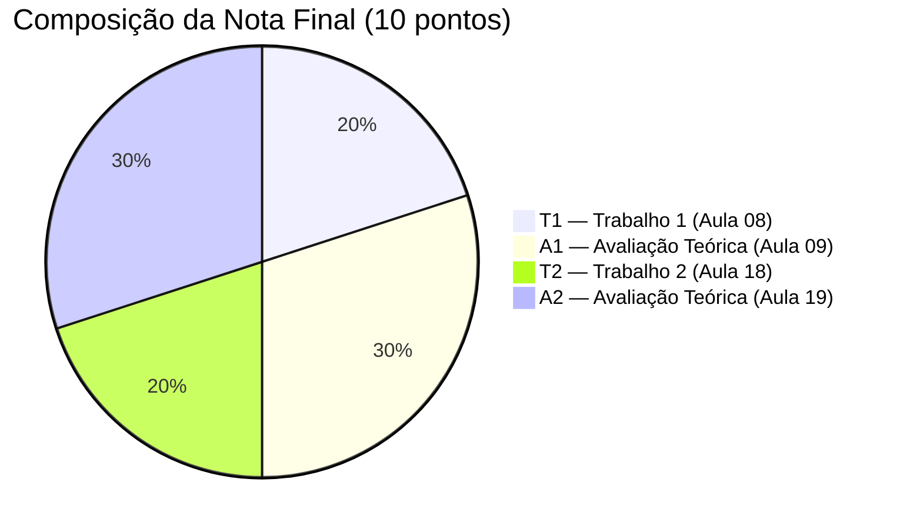

# Aula 08 — Entrega: Trabalho 1 (T1)

> **Disciplina:** Programação para Internet (ILP951)  
> **Professor:** Ronan Adriel Zenatti  
> **Esta aula:** Entrega e apresentação do T1 — **2 pontos**  
> **Pré-requisitos:** Aulas 01 a 07 concluídas — CRUD completo com Flask + MySQL + Bootstrap.

---

## 🗺️ O que acontece nesta aula

Esta aula não tem novo conteúdo técnico — ela é dedicada inteiramente à entrega, apresentação e avaliação do Trabalho 1. O T1 consolida tudo que foi desenvolvido nas Aulas 01 a 07: o ambiente configurado, Flask rodando com rotas e templates, Bootstrap responsivo, formulários com validação no servidor, e MySQL com CRUD completo para pelo menos uma entidade. Você vai apresentar o sistema funcionando para o professor, explicar as decisões técnicas tomadas, e entregar o repositório Git com o histórico de commits.

---

## Parte 1 — O que será avaliado

O T1 vale **2 pontos** na composição da nota do semestre. A avaliação é dividida em quatro critérios de igual peso, cada um valendo até 0,5 ponto.

### Critério 1 — Funcionalidade (0,5 ponto)

Este critério avalia se o sistema funciona corretamente de ponta a ponta. O avaliador vai testar diretamente no seu navegador: navegar entre as páginas, criar um novo registro, verificar que ele aparece na listagem, editá-lo, verificar que a alteração foi salva, desativá-lo, e verificar que ele desaparece da listagem principal. Qualquer operação que cause erro 500, tela em branco ou comportamento inesperado reduz a nota neste critério.

Para garantir a pontuação máxima, faça o seguinte ciclo de teste antes da entrega: reinicie o servidor Flask (`Ctrl+C` e `python app.py`), abra o navegador em modo anônimo, e percorra o ciclo CRUD completo do zero, como se fosse um usuário que nunca viu o sistema.

### Critério 2 — Código e organização (0,5 ponto)

Este critério avalia a qualidade e organização do código. O avaliador vai verificar: se o projeto tem estrutura de pastas correta (`templates/`, `static/`, `db.py`, `app.py`); se o `db.py` existe e centraliza a conexão; se as queries usam placeholders `%s` em vez de concatenação de strings (risco de SQL Injection); se a validação no servidor está presente em todos os formulários; se os templates herdam do `base.html` com ``; e se os commits no Git têm mensagens descritivas que narram a evolução do projeto.

### Critério 3 — Interface (0,5 ponto)

Este critério avalia a aparência e usabilidade da interface. O avaliador vai verificar: se o Bootstrap está aplicado consistentemente em todas as páginas; se a navbar permite navegar para todas as seções do sistema; se os formulários têm `label` para todos os campos, `placeholder` descritivo, e feedback visual de erro (flash messages); se a listagem tem cabeçalho identificando os campos; e se o sistema funciona razoavelmente em uma tela menor (responsividade básica).

### Critério 4 — Apresentação oral (0,5 ponto)

Este critério avalia se você consegue explicar o que construiu. O avaliador vai fazer perguntas sobre decisões de código — por que usar `redirect()` após o POST, qual a função do ``, como o `WHERE 1=1` funciona, o que acontece se você remover os placeholders `%s`. Você não precisa memorizar o código, mas precisa entender o que cada parte faz. A apresentação dura aproximadamente 5 minutos por aluno.

---

## Parte 2 — Checklist de entrega

Use este checklist nas 48 horas antes da aula de entrega. Cada item deve estar funcionando antes de você considerar o trabalho pronto.

### Ambiente e repositório

O arquivo `.gitignore` existe e inclui `venv/`, `__pycache__/` e `.env`. O `requirements.txt` está atualizado (executar `pip freeze > requirements.txt` antes do commit final). O repositório tem pelo menos 8 commits com mensagens descritivas — uma por aula, no mínimo. O `README.md` descreve o sistema, as tecnologias usadas e os passos para rodar localmente.

### Banco de dados

O arquivo `db_setup.py` existe e, quando executado em um ambiente limpo, cria a tabela e insere dados de exemplo. O arquivo `db.py` existe com `execute_query` e `execute_one`. A tabela tem pelo menos 6 colunas de tipos variados. Há pelo menos 5 registros de exemplo no banco.

### Flask e rotas

O `app.py` importa apenas do `db` — nenhuma lógica de banco está misturada com as rotas. Existem rotas para: listagem (`GET /entidade`), detalhe (`GET /entidade/<int:id>`), formulário de criação (`GET /entidade/novo`), processamento de criação (`POST /entidade/novo`), formulário de edição (`GET /entidade/<int:id>/editar`), processamento de edição (`POST /entidade/<int:id>/editar`), e exclusão lógica (`POST /entidade/<int:id>/deletar`). A `secret_key` está definida no `app.py`.

### Templates

O `base.html` existe com navbar, bloco de flash messages e rodapé. Todos os outros templates usam `` e ``. As URLs nos links usam `url_for()` em vez de strings fixas. Os formulários têm `label` com `for` correto e `placeholder` em todos os campos.

### Validação e segurança

Todos os formulários POST têm validação no servidor em Python — não apenas validação HTML. Os erros são exibidos como flash messages `danger`. Em caso de erro, o formulário é re-renderizado com os dados já digitados. Após POST bem-sucedido, há sempre `redirect()` (padrão PRG). Nenhuma query SQL usa f-string ou concatenação — todas usam `%s`.

---

## Parte 3 — Como escrever o README.md

O `README.md` é a porta de entrada do seu repositório. Um README bem escrito demonstra profissionalismo e facilita a avaliação. Ele deve conter no mínimo quatro seções.

A primeira seção descreve **o sistema**: qual o domínio escolhido (produtos de uma loja, livros de uma biblioteca, clientes de um serviço), o que o sistema faz, e quais entidades ele gerencia. Seja específico — "Sistema de cadastro de livros de uma biblioteca universitária com controle de status (disponível, emprestado, em restauração)" é muito melhor do que "Sistema para gerenciar livros".

A segunda seção lista as **tecnologias**: Python versão utilizada, Flask versão, MySQL versão, Bootstrap versão. Você pode obter as versões com `pip show flask` e `mysql --version`.

A terceira seção explica como **instalar e rodar**: os passos exatos para clonar o repositório, criar e ativar o ambiente virtual, instalar as dependências, criar o banco de dados no MySQL, rodar o `db_setup.py` e iniciar o servidor. Quem nunca viu o projeto deve conseguir rodá-lo seguindo apenas essas instruções.

A quarta seção mostra as **rotas disponíveis**: uma tabela ou lista descrevendo cada rota, o método HTTP e o que ela faz.

```markdown
# Sistema de Cadastro de Livros

Sistema web desenvolvido com Python/Flask e MySQL para gerenciar o acervo
de uma biblioteca universitária. Permite cadastrar, listar, editar e
desativar livros, com controle de status e quantidade em estoque.

## Tecnologias

- Python 3.12
- Flask 3.0.x
- MySQL 8.0
- Bootstrap 5.3

## Como rodar

1. Clone o repositório: `git clone <url>`
2. Crie o ambiente virtual: `python -m venv venv`
3. Ative: `venv\Scripts\activate` (Windows)
4. Instale as dependências: `pip install -r requirements.txt`
5. Crie o banco no MySQL Workbench: `CREATE DATABASE projeto_web;`
6. Configure a senha em `db.py` e `db_setup.py`
7. Execute: `python db_setup.py`
8. Inicie o servidor: `python app.py`
9. Acesse: http://localhost:5000

## Rotas

| Método | URL                    | Descrição                     |
|--------|------------------------|-------------------------------|
| GET    | /livros                | Lista todos os livros         |
| GET    | /livros/<id>           | Detalhe de um livro           |
| GET    | /livros/novo           | Formulário de cadastro        |
| POST   | /livros/novo           | Processa novo cadastro        |
| GET    | /livros/<id>/editar    | Formulário de edição          |
| POST   | /livros/<id>/editar    | Processa edição               |
| POST   | /livros/<id>/deletar   | Desativa o livro              |
```

---

## Parte 4 — Erros comuns antes da entrega

Alguns problemas aparecem com frequência nos trabalhos entregues. Verificar estes pontos pode fazer a diferença de meio ponto.

O primeiro erro comum é **commits todos feitos no último dia**. O histórico Git deve mostrar commits ao longo das semanas, demonstrando que o trabalho foi feito incrementalmente. Fazer todos os commits em um único dia antes da entrega prejudica o critério de organização e é inconsistente com a narrativa de desenvolvimento semana a semana.

O segundo erro é **senha do MySQL hardcoded como "root" sem senha**, o que significa que `db_setup.py` falha no computador do avaliador. A solução é garantir que `db_setup.py` imprime uma mensagem de erro clara indicando que a senha precisa ser configurada, e que o README instrui o avaliador a fazer isso.

O terceiro erro é **templates sem ``**, resultando em páginas sem navbar e sem consistência visual. Cada template (exceto o próprio `base.html`) deve começar com essa declaração.

O quarto erro é **validação apenas no HTML** (atributos `required`, `type="email"`, etc.) sem validação no Python. Como explicado na Aula 04, validação apenas do lado do cliente não conta como validação no servidor para fins de avaliação.

O quinto erro é **queries SQL com f-strings** como `f"SELECT * FROM produto WHERE id={id}"`. Mesmo que funcione no seu ambiente, isso é considerado uma falha grave de segurança e impacta o critério de código.

---

## Parte 5 — Preparação para a apresentação

A apresentação dura aproximadamente 5 minutos por aluno. O professor vai pedir para você demonstrar o sistema funcionando e depois fazer entre 3 e 5 perguntas técnicas. Não é uma prova oral, mas é uma verificação de que você entende o que construiu.

As perguntas mais frequentes são sobre os seguintes temas. Por que usamos `redirect()` após um POST bem-sucedido em vez de `render_template()`? O que aconteceria se não houvesse `redirect()`? Qual é a função do `` no `base.html` e do `` no template filho? Como o `WHERE 1=1` permite adicionar filtros dinâmicos? O que é SQL Injection e como os placeholders `%s` protegem contra isso? Por que a exclusão é feita via POST e não via um link GET?

Para se preparar, abra cada arquivo do projeto e tente explicar em voz alta o que cada função faz e por que cada decisão foi tomada dessa forma. Se você consegue explicar para si mesmo, consegue explicar para o professor.

---

## Critérios de avaliação — Tabela resumo

| Critério | Peso | O que verifica |
|---|---|---|
| Funcionalidade | 0,5 pt | CRUD completo funcionando sem erros |
| Código e organização | 0,5 pt | Estrutura, db.py, SQL seguro, commits |
| Interface | 0,5 pt | Bootstrap consistente, formulários acessíveis |
| Apresentação oral | 0,5 pt | Entendimento das decisões técnicas |
| **Total** | **2,0 pt** | |

---

## Composição da nota do semestre — Posição do T1



O T1 representa 20% da nota final. Junto com a A1 da próxima aula, as duas primeiras avaliações somam 5 pontos — metade do semestre. A preparação que você faz para o T1 (entender e conseguir explicar o CRUD completo) é diretamente a preparação para a A1.

---

> ⬅️ [Aula anterior: CRUD — Edição e Exclusão](Aula_07_CRUD_Edicao_e_Exclusao.md) | ➡️ [Próxima Aula: Avaliação Teórica A1](Aula_09_Apresentacao_e_Avaliacao_Teorica.md)
