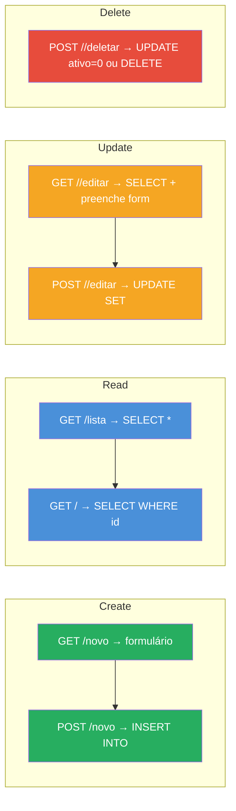
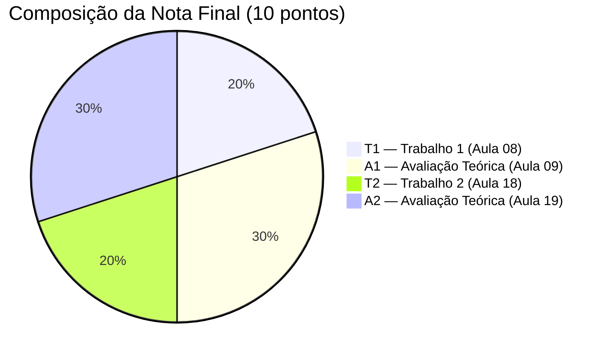

# Aula 09 — Apresentação e Avaliação Teórica (A1)

> **Disciplina:** Programação para Internet (ILP951)  
> **Professor:** Ronan Adriel Zenatti  
> **Esta aula:** Avaliação Teórica A1 — **3 pontos**  
> **Conteúdo avaliado:** Aulas 01 a 08 — do ambiente de desenvolvimento ao CRUD completo.

---

## 🗺️ O que acontece nesta aula

A A1 é a avaliação teórica do primeiro bloco da disciplina. Ela vale **3 pontos** e cobre todo o conteúdo das Aulas 01 a 08: configuração do ambiente, HTML5, Git, Flask, Bootstrap, Jinja2, rotas, formulários, HTTP, MySQL e CRUD. Esta aula não tem novo conteúdo a ser ensinado — ela é dedicada inteiramente à realização da prova. As seções abaixo são um guia de revisão estruturado que você deve estudar nas aulas anteriores à avaliação.

---

## Parte 1 — Estrutura da avaliação

A A1 é uma prova escrita com duração de aproximadamente 80 minutos. Ela é composta por três tipos de questão. As questões conceituais pedem a explicação ou comparação de conceitos — por exemplo, explicar a diferença entre GET e POST, ou descrever o papel do `base.html`. As questões de análise de código pedem que você leia um trecho de código e explique o que ele faz, identifique um erro, ou complete a parte faltante. As questões práticas pedem que você escreva código: uma rota Flask, um template Jinja2, um comando SQL, ou um formulário HTML.

---

## Parte 2 — Guia de revisão: Bloco 1 (Aulas 01–04)

### Ambiente e Git

O fluxo de trabalho com Git deve estar claro: `git init` para iniciar o repositório, `git add .` para preparar os arquivos para o commit, `git commit -m "mensagem"` para salvar o estado no histórico, `git remote add origin <url>` para vincular ao GitHub, e `git push` para enviar ao repositório remoto. O `.gitignore` tem o papel de listar arquivos e pastas que não devem ser versionados — a pasta `venv/` nunca vai para o repositório porque é um ambiente local e seria enorme.

O ambiente virtual (`venv`) isola as dependências do projeto. Quando você instala o Flask dentro do venv, ele fica disponível apenas para esse projeto — sem conflito com outros projetos ou com o Python do sistema. O comando `pip freeze > requirements.txt` captura todas as dependências instaladas, e `pip install -r requirements.txt` as reinstala em outro ambiente.

### HTML5 essencial

A estrutura mínima de um documento HTML5 válido começa com `<!DOCTYPE html>` (declara o tipo do documento), seguida pela tag `<html lang="pt-BR">` (especifica o idioma), o `<head>` (metadados, título e links para CSS), e o `<body>` (conteúdo visível). Dentro do `<head>`, a tag `<meta charset="UTF-8">` garante que acentos e caracteres especiais sejam exibidos corretamente, e `<meta name="viewport" content="width=device-width, initial-scale=1.0">` é o que torna a página responsiva em dispositivos móveis.

### Flask: rotas e templates

Uma rota Flask é criada com o decorador `@app.route('/caminho')` seguido de uma função Python. O decorador registra a URL; a função define o que retornar quando aquela URL é acessada. A função `render_template('arquivo.html', variavel=valor)` carrega o arquivo HTML da pasta `templates/` e passa variáveis para ele.

O Jinja2 usa três tipos de marcação: `{{ variavel }}` para exibir um valor, `` para executar uma instrução de controle (if, for, extends, block), e `{# comentario #}` para comentários que nunca aparecem no HTML final. Os filtros formatam valores: `{{ preco | round(2) }}` arredonda para 2 casas decimais; `{{ texto | truncate(50) }}` corta em 50 caracteres; `{{ valor | default('N/A') }}` exibe "N/A" se o valor for vazio ou nulo.

A herança de templates funciona com dois elementos complementares. O `base.html` define a estrutura comum e declara blocos com `...`. Cada template filho começa com `` e preenche os blocos com seu conteúdo específico. O resultado é que navbar e rodapé são definidos uma única vez, em um único lugar.

### HTTP: GET, POST e formulários

O protocolo HTTP governa toda a comunicação web. Cada requisição tem um método: **GET** é usado para buscar informações — os dados vão na URL como query string, ficam no histórico, podem ser favoritados. **POST** é usado para enviar dados para processamento — os dados vão no corpo da requisição, invisíveis na URL, sem limite de tamanho. A regra prática é clara: se a ação lê dados, use GET; se a ação cria, modifica ou remove dados, use POST.

Os codes de status HTTP comunicam o resultado de cada requisição: 200 significa sucesso, 302 significa redirecionamento temporário (o que o Flask usa no `redirect()`), 404 significa "não encontrado", e 500 significa erro interno no servidor.

No Flask, `request.method` retorna o método da requisição atual. `request.form['campo']` acessa dados de um POST. `request.args.get('campo')` acessa dados de um GET (query string). O padrão PRG (Post-Redirect-Get) garante que após um POST bem-sucedido, o servidor responda com um redirect — nunca com `render_template` diretamente — para evitar o reenvio de dados ao pressionar F5.

A validação no servidor é sempre obrigatória, independentemente de qualquer validação HTML no cliente. Atributos como `required` e `type="email"` são facilmente contornáveis pelo usuário via ferramentas do navegador.

---

## Parte 3 — Guia de revisão: Bloco 2 (Aulas 05–08)

### MySQL e SQL

O MySQL organiza dados em tabelas com linhas (registros) e colunas (atributos). Os principais tipos de dados são `VARCHAR(n)` para texto curto, `TEXT` para texto longo, `INT` para inteiros, `DECIMAL(p,d)` para valores decimais (preços), `TINYINT(1)` para booleano (0/1), e `TIMESTAMP DEFAULT CURRENT_TIMESTAMP` para data e hora automáticos.

O `INT AUTO_INCREMENT PRIMARY KEY` é a forma padrão de definir uma chave primária auto-incremental — o banco gera automaticamente o próximo número para cada novo registro.

Os quatro comandos SQL fundamentais são `INSERT INTO tabela (col1, col2) VALUES (%s, %s)` para criar registros, `SELECT * FROM tabela WHERE condicao ORDER BY coluna` para ler, `UPDATE tabela SET col1=%s WHERE id=%s` para editar, e `DELETE FROM tabela WHERE id=%s` para excluir. O `WHERE` é sempre obrigatório em `UPDATE` e `DELETE` — sem ele, a operação afeta **todos** os registros da tabela.

### Conexão Python-MySQL e segurança

O módulo `db.py` centraliza a conexão. A função `execute_query(sql, params, fetch=True)` executa qualquer query SQL de forma parametrizada. O parâmetro `dictionary=True` no cursor faz cada linha retornar como dicionário, permitindo `produto['nome']` em vez de `produto[0]`.

SQL Injection é a vulnerabilidade que ocorre quando dados do usuário são concatenados diretamente em strings SQL com f-strings ou `+`. A solução é usar sempre placeholders `%s` — o conector trata os valores como dados puros, nunca como código SQL. Esta é a regra mais importante de segurança da disciplina.

### CRUD completo

O ciclo CRUD mapeia diretamente para operações SQL e padrões de rota Flask:



A exclusão lógica (`UPDATE ativo=0`) é preferida à exclusão física (`DELETE FROM`) porque preserva o histórico e permite recuperação. O Delete deve sempre ser feito via POST — um link GET para exclusão é vulnerável a CSRF.

---

## Parte 4 — Banco de questões de revisão

Tente responder cada questão antes de olhar a resposta. Se você não consegue responder de memória, volte ao material da aula correspondente.

**Questão 1.** Explique com suas próprias palavras a diferença entre um ambiente virtual Python e a instalação global do Python. Por que é importante usar venv em projetos web?

*Resposta esperada:* O ambiente virtual isola as dependências de cada projeto — Flask instalado no venv de um projeto não interfere com outro projeto que usa uma versão diferente. A instalação global afeta todos os projetos simultaneamente. Em produção, o servidor sabe exatamente quais bibliotecas e versões instalar a partir do `requirements.txt`, sem conflitos.

**Questão 2.** Um aluno escreveu o seguinte código em um template. Identifique o erro e corrija:

```html

```

*Resposta esperada:* O erro é usar `` para exibir um valor. `` é para instruções de controle (if, for, extends). Para exibir um valor, a sintaxe correta é `{{ nome_usuario }}`.

**Questão 3.** Explique o padrão PRG. Por que é problemático usar `render_template()` diretamente após um POST bem-sucedido?

*Resposta esperada:* PRG significa Post-Redirect-Get. Após processar um POST com sucesso, o servidor envia um redirect (HTTP 302) em vez de renderizar uma página diretamente. O navegador então faz um GET para a nova URL. Se o servidor renderizasse diretamente após o POST e o usuário pressionasse F5, o navegador perguntaria se deve reenviar os dados do formulário — o que causaria duplicação de registros (dois cadastros idênticos, duas compras, etc.).

**Questão 4.** Por que o seguinte código é perigoso? Como corrigi-lo?

```python
nome = request.form['nome']
cursor.execute(f"SELECT * FROM usuario WHERE nome='{nome}'")
```

*Resposta esperada:* É um exemplo clássico de SQL Injection. Se o usuário digitar `' OR '1'='1`, a query retorna todos os usuários. A correção é usar placeholders: `cursor.execute("SELECT * FROM usuario WHERE nome = %s", (nome,))`.

**Questão 5.** Complete a rota Flask abaixo para buscar um produto do banco e renderizá-lo. Trate o caso em que o produto não existe:

```python
@app.route('/produto/<int:id>')
def detalhe(id):
    # complete aqui
```

*Resposta esperada:*
```python
@app.route('/produto/<int:id>')
def detalhe(id):
    produto = execute_one('SELECT * FROM produto WHERE id = %s', (id,))
    if not produto:
        flash('Produto não encontrado.', 'warning')
        return redirect(url_for('lista_produtos'))
    return render_template('detalhe.html', produto=produto)
```

**Questão 6.** Escreva o template Jinja2 que herda do `base.html` e exibe uma lista de produtos em uma tabela Bootstrap. Se a lista estiver vazia, exibe a mensagem "Nenhum produto cadastrado".

*Resposta esperada:*
```html


<table class="table">
  <tbody>
    
    <tr><td>{{ p.nome }}</td><td>{{ p.preco }}</td></tr>
    
    <tr><td colspan="2">Nenhum produto cadastrado.</td></tr>
    
  </tbody>
</table>

```

**Questão 7.** Explique a diferença entre exclusão lógica e exclusão física no contexto de um banco de dados. Quando cada uma deve ser usada?

*Resposta esperada:* Exclusão física usa `DELETE FROM` e remove o registro permanentemente — dados históricos são perdidos e pode quebrar relacionamentos com outras tabelas. Exclusão lógica usa `UPDATE SET ativo=0` e apenas marca o registro como inativo, preservando os dados. A exclusão lógica é preferida em sistemas de produção porque permite recuperação, preserva histórico e evita quebra de integridade referencial. A física é usada quando há certeza de que os dados nunca serão necessários novamente.

**Questão 8.** Explique o que o código abaixo faz. Por que o `WHERE 1=1` é usado?

```python
sql = 'SELECT * FROM produto WHERE 1=1'
params = []
if busca:
    sql += ' AND nome LIKE %s'
    params.append(f'%{busca}%')
if filtro == 'ativos':
    sql += ' AND ativo = 1'
```

*Resposta esperada:* O código monta uma query SQL dinamicamente com filtros opcionais. O `WHERE 1=1` é uma condição sempre verdadeira que serve de "ancora" — ela não filtra nada por si só, mas permite adicionar condições com `AND` de forma condicional sem precisar verificar se é o primeiro filtro ou não. Sem ele, seria necessário controlar se o primeiro filtro usa `WHERE` ou `AND`, complicando o código.

---

## Composição da nota do semestre



Com a A1 concluída e o T1 entregue, você terá 5 dos 10 pontos avaliados. O segundo bloco começa na Aula 10, introduzindo o relacionamento entre tabelas (cardinalidade 1:N) — a fundação para sistemas com múltiplas entidades conectadas.

---

> ⬅️ [Aula anterior: Entrega do Trabalho 1](Aula_08_Entrega_Trabalho_1.md) | ➡️ [Próxima Aula: Modelagem Relacional 1:N](Aula_10_Modelagem_Relacional.md)
