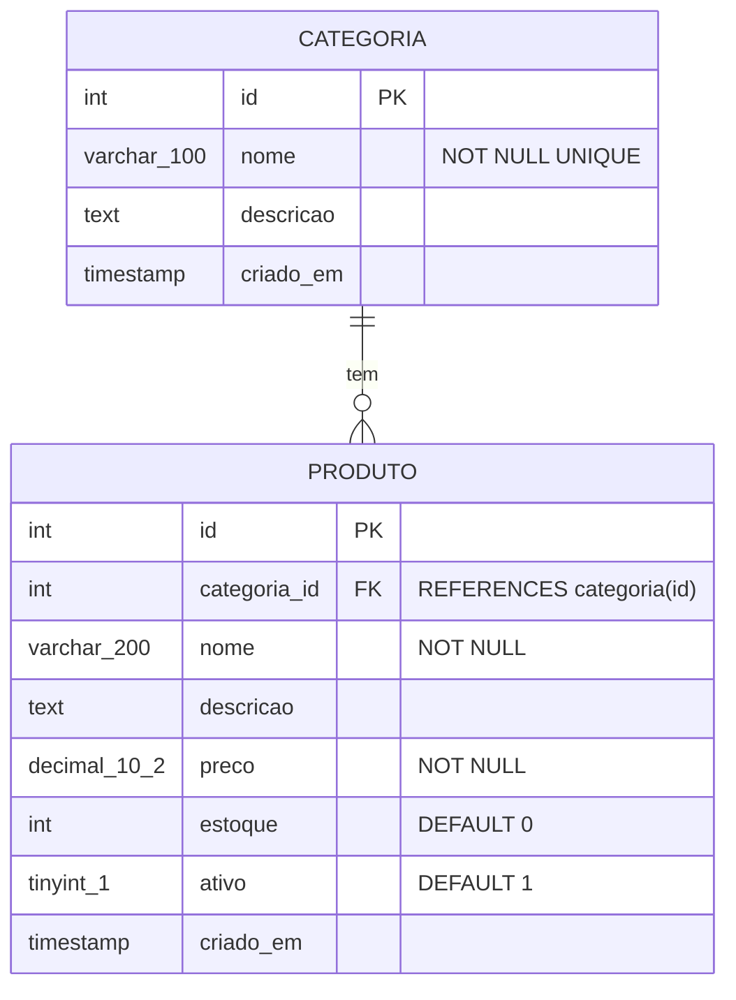
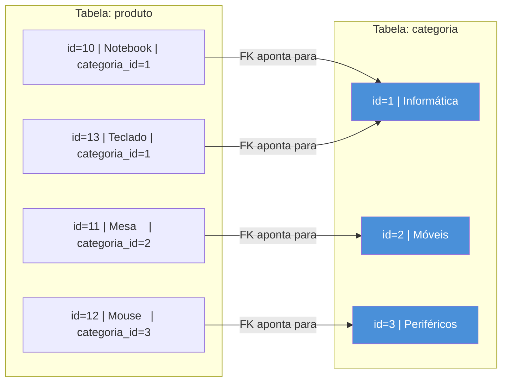
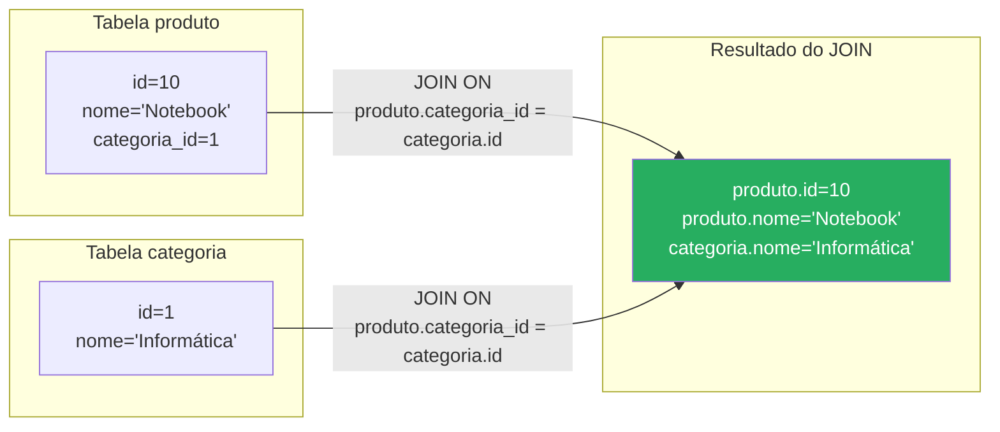

# Aula 10 — Modelagem Relacional: Relacionamento 1:N

> **Disciplina:** Programação para Internet (ILP951)  
> **Professor:** Ronan Adriel Zenatti  
> **Pré-requisitos:** Aula 09 concluída — A1 realizada, CRUD básico dominado.

---

## 🗺️ O que você vai aprender nesta aula

Até agora, o sistema trabalhou com apenas uma entidade isolada — produto, livro, cliente. Sistemas reais, porém, são feitos de entidades que se relacionam: um pedido pertence a um cliente, um produto pertence a uma categoria, um funcionário trabalha em um departamento. Hoje você vai aprender a modelar e implementar o tipo de relacionamento mais comum em sistemas de informação: o **um para muitos (1:N)**. Vai entender o que são chaves estrangeiras, como criar tabelas relacionadas no MySQL, e como escrever queries com `JOIN` para buscar dados de múltiplas tabelas de uma vez. Ao final desta aula, o banco de dados do seu sistema vai ganhar uma segunda tabela conectada à primeira — e o projeto evolui de uma entidade isolada para um sistema com contexto real.

---

## Parte 1 — Relacionamentos: o que são e por que existem

### O problema da redundância

Imagine um sistema de produtos sem categorias. Você cadastra: "Notebook Dell — Tipo: Informática", "Mouse Logitech — Tipo: Informática", "Teclado Mecânico — Tipo: Informática". A palavra "Informática" está repetida em cada registro. Agora imagine que a categoria se chamava "Computação" e foi renomeada para "Informática". Você precisaria atualizar todos os produtos que a referenciavam — potencialmente milhares de registros — com risco de inconsistência se algum for esquecido.

A solução é separar as entidades em tabelas distintas e **relacioná-las por referência**, em vez de repetir os dados. A tabela `categoria` guarda o nome uma única vez. A tabela `produto` guarda apenas o `id` da categoria. Quando a categoria muda de nome, você altera um único registro na tabela `categoria` — todos os produtos automaticamente refletem a mudança porque eles guardam apenas a referência (o ID), não o nome em si.

Esse princípio chama-se **normalização** e é a base da modelagem relacional.

[Ilustração educacional comparando dois designs de tabela lado a lado. Lado esquerdo "Sem relacionamento — dados redundantes": tabela produto com coluna "categoria" repetindo o texto "Informática" em três linhas destacadas em vermelho. Uma seta vermelha com rótulo "Renomear: atualizar em N linhas". Lado direito "Com relacionamento — dados normalizados": tabela produto com coluna "categoria_id" contendo números (1, 1, 1) e tabela categoria separada com id=1 e nome="Informática". Uma seta verde "Renomear: atualizar 1 linha". Fundo branco, flat design, paleta vermelho/verde educacional, legendas em português.]


### O que é cardinalidade 1:N

A **cardinalidade** descreve quantas instâncias de uma entidade podem se relacionar com quantas instâncias de outra entidade. O relacionamento **1:N (um para muitos)** é o mais comum: **uma** categoria tem **muitos** produtos, mas cada produto pertence a **uma** categoria. **Um** cliente faz **muitos** pedidos, mas cada pedido é de **um** cliente. **Um** departamento tem **muitos** funcionários, mas cada funcionário pertence a **um** departamento.

A chave para identificar um 1:N é perguntar: "um X pode ter vários Y? E um Y pode pertencer a vários X?" Se a resposta for "sim" para a primeira e "não" para a segunda, é um 1:N. Quando a resposta for "sim" para ambas, é um N:N (muitos para muitos) — que veremos nas aulas finais.



O símbolo `||--o{` no diagrama ER é a notação crow's foot: `||` significa "exatamente um" e `o{` significa "zero ou muitos". Portanto, uma categoria tem zero ou muitos produtos, e cada produto pertence a exatamente uma categoria.

---

## Parte 2 — Chave estrangeira (FK): o mecanismo do relacionamento

### O que é uma Foreign Key

A **chave estrangeira** (FK — Foreign Key) é o campo em uma tabela que referencia a chave primária de outra tabela. No nosso exemplo, `produto.categoria_id` é uma FK que referencia `categoria.id`. Esse campo "aponta" para um registro específico da tabela `categoria`.

A FK traz consigo uma propriedade chamada **integridade referencial**: o banco de dados garante automaticamente que você nunca vai inserir um produto com `categoria_id = 99` se não existir nenhuma categoria com `id = 99`. Essa garantia é automática — o banco rejeita a operação com um erro se você tentar violar a referência.



Observe que "Informática" (id=1) é referenciada por dois produtos (Notebook e Teclado). Isso é exatamente o 1:N em ação.

### Comportamentos ON DELETE e ON UPDATE

Quando um registro do lado "1" do relacionamento é modificado ou deletado, o banco precisa saber o que fazer com os registros do lado "N" que o referenciam. Existem três comportamentos principais. `RESTRICT` (padrão) impede a deleção ou atualização se houver registros dependentes — tentar deletar "Informática" enquanto houver produtos nela gerará um erro. `CASCADE` propaga a operação — deletar "Informática" deletaria automaticamente todos os produtos dela (perigoso em geral). `SET NULL` coloca `NULL` no campo FK dos registros dependentes — deletar "Informática" faria `categoria_id` dos produtos virar NULL.

Para este projeto, usaremos `ON DELETE RESTRICT` — que protege contra deleções acidentais — e `ON UPDATE CASCADE` — que propaga mudanças de ID automaticamente (embora com `AUTO_INCREMENT` as PKs raramente mudem).

---

## Parte 3 — Criando tabelas relacionadas no MySQL

### Atualização do db_setup.py

A tabela pai (`categoria`) deve ser criada **antes** da tabela filha (`produto`), porque a FK de `produto` referencia `categoria`. Se você tentar criar `produto` primeiro, o MySQL não encontrará a tabela `categoria` e gerará um erro.

Atualize o `db_setup.py` para criar as duas tabelas na ordem correta e popular ambas com dados de exemplo:

```python
# Adicione ao bloco try do db_setup.py, antes de criar a tabela produto

# Passo 2a: cria a tabela de categorias (deve ser criada ANTES de produto)
cursor.execute('''
    CREATE TABLE IF NOT EXISTS categoria (
        id         INT            AUTO_INCREMENT PRIMARY KEY,
        nome       VARCHAR(100)   NOT NULL UNIQUE,
        descricao  TEXT,
        criado_em  TIMESTAMP      DEFAULT CURRENT_TIMESTAMP
    ) CHARACTER SET utf8mb4 COLLATE utf8mb4_unicode_ci
''')
# UNIQUE em 'nome': não permite duas categorias com o mesmo nome
conn.commit()
print('✅ Tabela "categoria" criada.')

# Insere categorias de exemplo
cursor.execute('SELECT COUNT(*) FROM categoria')
if cursor.fetchone()[0] == 0:
    categorias = [
        ('Informática',  'Equipamentos e acessórios de tecnologia'),
        ('Móveis',       'Mobiliário para escritório e casa'),
        ('Periféricos',  'Dispositivos de entrada e saída'),
        ('Monitores',    'Telas e displays'),
    ]
    cursor.executemany(
        'INSERT INTO categoria (nome, descricao) VALUES (%s, %s)',
        categorias
    )
    conn.commit()
    print(f'✅ {len(categorias)} categorias inseridas.')
```

```python
# Passo 2b: cria (ou recria) a tabela produto COM a chave estrangeira
# Se a tabela produto já existe sem FK, você pode precisar deletá-la antes:
# cursor.execute('DROP TABLE IF EXISTS produto')

cursor.execute('''
    CREATE TABLE IF NOT EXISTS produto (
        id           INT            AUTO_INCREMENT PRIMARY KEY,
        categoria_id INT,
        nome         VARCHAR(200)   NOT NULL,
        descricao    TEXT,
        preco        DECIMAL(10, 2) NOT NULL,
        estoque      INT            NOT NULL DEFAULT 0,
        ativo        TINYINT(1)     NOT NULL DEFAULT 1,
        criado_em    TIMESTAMP      DEFAULT CURRENT_TIMESTAMP,

        -- Define a chave estrangeira
        FOREIGN KEY (categoria_id)
            REFERENCES categoria(id)
            ON DELETE RESTRICT    -- impede deletar categoria com produtos
            ON UPDATE CASCADE     -- propaga mudanças de id automaticamente
    ) CHARACTER SET utf8mb4 COLLATE utf8mb4_unicode_ci
''')
conn.commit()
print('✅ Tabela "produto" com FK criada.')
```

---

## Parte 4 — O comando JOIN: unindo tabelas em uma consulta

### Por que precisamos de JOIN

Quando você executa `SELECT * FROM produto`, o campo `categoria_id` retorna apenas o número (por exemplo, `1`). Para exibir o **nome da categoria** junto com os dados do produto, você precisa buscar dados de **duas tabelas ao mesmo tempo**. É para isso que serve o `JOIN`.

O `JOIN` combina linhas de duas tabelas com base em uma condição de correspondência — geralmente a FK de uma tabela igualada à PK da outra. O resultado é uma tabela virtual que contém colunas de ambas as fontes.



### Tipos de JOIN

O **INNER JOIN** retorna apenas as linhas que têm correspondência em ambas as tabelas. Um produto sem `categoria_id` (NULL) não aparece no resultado. O **LEFT JOIN** retorna todas as linhas da tabela da esquerda, mesmo que não tenham correspondência na direita — produtos sem categoria aparecem com os campos de categoria como NULL. Para sistemas web, o LEFT JOIN é geralmente mais adequado porque não exclui silenciosamente dados incompletos.

```sql
-- INNER JOIN: só retorna produtos COM categoria
SELECT
    p.id,
    p.nome       AS produto_nome,
    p.preco,
    c.nome       AS categoria_nome
FROM produto p
INNER JOIN categoria c ON p.categoria_id = c.id
WHERE p.ativo = 1
ORDER BY c.nome, p.nome;
-- Os aliases 'p' e 'c' evitam ambiguidade quando dois campos têm o mesmo nome (ex: ambos têm 'nome')

-- LEFT JOIN: retorna todos os produtos, com ou sem categoria
SELECT
    p.id,
    p.nome                                        AS produto_nome,
    p.preco,
    COALESCE(c.nome, 'Sem categoria')             AS categoria_nome
FROM produto p
LEFT JOIN categoria c ON p.categoria_id = c.id
WHERE p.ativo = 1
ORDER BY categoria_nome, p.nome;
-- COALESCE(valor, alternativa): retorna o primeiro valor não-NULL
-- Se c.nome for NULL (sem categoria), retorna 'Sem categoria'
```

Execute essas queries no Workbench e observe a diferença. A de `INNER JOIN` exclui produtos sem categoria; a de `LEFT JOIN` inclui todos com "Sem categoria" para os que não têm.

---

## Parte 5 — Integrando JOIN nas rotas Flask

Atualize as funções do `app.py` para usar JOIN ao buscar produtos:

```python
@app.route('/produtos')
def lista_produtos():
    busca  = request.args.get('busca', '').strip()
    filtro = request.args.get('filtro', 'todos')
    cat_id = request.args.get('categoria', '')

    # Query com LEFT JOIN para incluir o nome da categoria
    sql    = '''
        SELECT p.*, COALESCE(c.nome, 'Sem categoria') AS categoria_nome
        FROM produto p
        LEFT JOIN categoria c ON p.categoria_id = c.id
        WHERE 1=1
    '''
    params = []

    if busca:
        sql += ' AND p.nome LIKE %s'
        params.append(f'%{busca}%')
    if filtro == 'ativos':
        sql += ' AND p.ativo = 1'
    elif filtro == 'inativos':
        sql += ' AND p.ativo = 0'
    if cat_id:
        sql += ' AND p.categoria_id = %s'
        params.append(int(cat_id))

    sql += ' ORDER BY c.nome, p.nome'

    try:
        produtos = execute_query(sql, params if params else None, fetch=True)
        # Para o filtro de categoria, busca todas as categorias para popular o select
        categorias = execute_query('SELECT id, nome FROM categoria ORDER BY nome', fetch=True)
    except Exception as e:
        flash(f'Erro ao buscar dados: {e}', 'danger')
        produtos, categorias = [], []

    return render_template('produtos.html',
                           produtos=produtos,
                           total=len(produtos),
                           categorias=categorias,
                           busca=busca, filtro=filtro, cat_id=cat_id)
```

No template `produtos.html`, adicione o filtro de categoria ao formulário de busca:

```html
{# Dentro do form de filtros, após o select de status: #}
<div class="col-md-3">
  <select class="form-select" name="categoria">
    <option value="">Todas as categorias</option>
    
      <option value="{{ cat.id }}"
              selected>
        {{ cat.nome }}
      </option>
    
  </select>
</div>
```

E na tabela de produtos, adicione a coluna de categoria:

```html
{# No thead: #}
<th>Categoria</th>

{# No tbody, dentro do loop: #}
<td>
  <span class="badge bg-info text-dark">{{ p.categoria_nome }}</span>
</td>
```

[Captura de tela ilustrativa mostrando a listagem de produtos atualizada com a coluna "Categoria". A tabela agora tem seis colunas: #, Nome, Categoria (com badges azuis como "Informática", "Móveis"), Preço, Estoque, Status e Ações. O formulário de filtros no topo tem um quarto campo: select "Todas as categorias". Estilo screenshot educacional realista com Bootstrap.]


---

## Parte 6 — CRUD completo de categorias

Antes de vincular produtos a categorias, é necessário ter as categorias cadastradas pelo sistema. Crie rotas e templates para gerenciar categorias — o CRUD de categorias é mais simples que o de produtos, pois tem menos campos, mas segue o mesmo padrão:

```python
@app.route('/categorias')
def lista_categorias():
    categorias = execute_query(
        '''SELECT c.*, COUNT(p.id) AS total_produtos
           FROM categoria c
           LEFT JOIN produto p ON p.categoria_id = c.id AND p.ativo = 1
           GROUP BY c.id
           ORDER BY c.nome''',
        fetch=True
    )
    # COUNT(p.id): conta os produtos ativos de cada categoria
    # GROUP BY c.id: agrupa o resultado por categoria para que o COUNT funcione
    return render_template('categorias.html',
                           categorias=categorias,
                           total=len(categorias))


@app.route('/categorias/nova', methods=['GET', 'POST'])
def nova_categoria():
    if request.method == 'POST':
        nome      = request.form.get('nome', '').strip()
        descricao = request.form.get('descricao', '').strip()

        erros = []
        if not nome:
            erros.append('O nome é obrigatório.')
        elif len(nome) < 3:
            erros.append('O nome deve ter ao menos 3 caracteres.')

        # Verifica se já existe uma categoria com esse nome (campo UNIQUE)
        if nome:
            existe = execute_one('SELECT id FROM categoria WHERE nome = %s', (nome,))
            if existe:
                erros.append(f'Já existe uma categoria com o nome "{nome}".')

        if erros:
            for e in erros:
                flash(e, 'danger')
            return render_template('categoria_form.html', nome=nome, descricao=descricao)

        execute_query(
            'INSERT INTO categoria (nome, descricao) VALUES (%s, %s)',
            (nome, descricao)
        )
        flash(f'Categoria "{nome}" criada!', 'success')
        return redirect(url_for('lista_categorias'))

    return render_template('categoria_form.html')
```

---

## Atividade da Aula

Adicione uma segunda entidade ao seu sistema que se relaciona 1:N com a entidade principal. Se o seu sistema é de produtos, adicione `categoria`. Se é de livros, adicione `autor` ou `genero`. Se é de pacientes, adicione `especialidade`. Atualize o `db_setup.py` para criar as duas tabelas na ordem correta, com FK e dados de exemplo em ambas. Crie o CRUD completo da entidade pai (pelo menos listagem e cadastro). Atualize a listagem da entidade filho para usar `LEFT JOIN` e exibir o nome da entidade pai. Adicione o campo FK (select com as opções da entidade pai) no formulário de cadastro da entidade filho.

```
git add .
git commit -m "Aula 10: relacionamento 1:N com FK, JOIN na listagem"
git push
```

---

## Resumo da Aula

Hoje você expandiu o modelo de dados do sistema além de uma única entidade. Aprendeu o conceito de relacionamento 1:N — uma entidade tem muitas da outra — e como ele resolve o problema da redundância de dados. Entendeu o papel da chave estrangeira (FK) como mecanismo de relacionamento e garantia de integridade referencial. Criou tabelas relacionadas com `FOREIGN KEY`, `ON DELETE RESTRICT` e `ON UPDATE CASCADE`. Dominou o `INNER JOIN` e o `LEFT JOIN` para buscar dados de múltiplas tabelas em uma única query. Integrou o JOIN nas rotas Flask e adicionou a coluna de categoria na listagem. E aprendeu o `GROUP BY` com `COUNT()` para exibir o total de registros relacionados.

[Mapa mental educacional com "Aula 10" no centro em círculo azul. Quatro ramos. Ramo verde "Cardinalidade 1:N": "Uma categoria tem muitos produtos", "Cada produto pertence a uma categoria", "Identificar 1:N pelo teste 'um X tem vários Y?'". Ramo azul "Foreign Key": "FK aponta para PK de outra tabela", "ON DELETE RESTRICT / CASCADE / SET NULL", "Integridade referencial automática". Ramo laranja "SQL JOIN": "INNER JOIN: só correspondências", "LEFT JOIN: todos da esquerda + NULL", "Aliases p, c para evitar ambiguidade", "COALESCE para tratar NULLs". Ramo roxo "Normalização": "Dados sem repetição", "Uma mudança afeta um registro", "Relacionar por ID, não por texto". Fundo branco, flat design, ícones em cada ramo, legendas em português.]


Na próxima aula você vai implementar o CRUD completo para o relacionamento 1:N — incluindo o formulário de cadastro com select dinâmico para escolher a entidade pai, validação de FK, e exclusão com verificação de dependências.

---

## Referências e Leitura Complementar

O conceito de normalização de banco de dados — incluindo as formas normais (1FN, 2FN, 3FN) — é explorado em profundidade na disciplina de Banco de Dados Relacional. Para JOIN em particular, a documentação MySQL em `dev.mysql.com/doc/refman/8.0/en/join.html` lista todos os tipos disponíveis com exemplos. O livro **Learning SQL** de Alan Beaulieu (O'Reilly) cobre JOIN com a didática mais clara disponível em um único volume.

---

> ⬅️ [Aula anterior: Avaliação Teórica A1](Aula_09_Apresentacao_e_Avaliacao_Teorica.md) | ➡️ [Próxima Aula: CRUD Relacional — Implementação](Aula_11_CRUD_Relacional.md)
