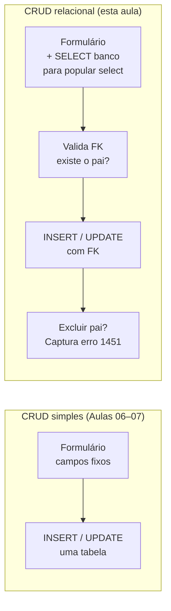

# Aula 11 — CRUD Relacional: Implementação

> **Disciplina:** Programação para Internet (ILP951)  
> **Professor:** Ronan Adriel Zenatti  
> **Pré-requisitos:** Aula 10 concluída — relacionamento 1:N modelado, tabelas com FK criadas no banco.

---

## 🗺️ O que você vai aprender nesta aula

Na aula anterior você modelou o relacionamento entre duas entidades e criou as tabelas com chave estrangeira. Hoje você implementa o **CRUD completo sobre esse modelo relacional** — as quatro operações agora envolvem múltiplas tabelas. Você vai aprender a popular selects dinamicamente com dados do banco, a validar a existência do registro pai antes de inserir o filho, e a tratar o erro de integridade referencial quando alguém tenta excluir um registro que ainda tem filhos vinculados.

---

## Parte 1 — Os três desafios novos do CRUD relacional

No CRUD de tabela única, cada operação envolvia exatamente um registro em exatamente uma tabela. No modelo relacional, surgem três desafios que não existiam antes:



O **primeiro desafio** é o formulário que depende de dados do banco: o campo de seleção do registro pai (ex.: "Selecione o cliente") precisa ser preenchido com dados reais do MySQL toda vez que a página é carregada — tanto no GET quanto no re-render por erro de validação.

O **segundo desafio** é a validação da chave estrangeira no servidor: o `cliente_id` recebido no formulário precisa corresponder a um registro real na tabela `cliente`. Sem isso, um usuário experiente pode forjar um ID inválido e causar um erro genérico de banco.

O **terceiro desafio** é o tratamento do erro de integridade referencial na exclusão: quando tentamos deletar um cliente que tem pedidos, o MySQL lança o erro `1451`. O Python precisa capturar esse erro e apresentar uma mensagem útil — não um traceback técnico.

[Diagrama educacional em três colunas rotuladas "Desafio 1 — Select dinâmico", "Desafio 2 — Validação FK", "Desafio 3 — Erro 1451". Coluna 1 com fundo azul claro: formulário com campo select mostrando "-- opções do banco --", seta do Flask para MySQL "SELECT id, nome FROM cliente", seta de volta para o formulário com a lista populada. Coluna 2 com fundo amarelo: formulário enviado com cliente_id=99, servidor checando "SELECT id FROM cliente WHERE id=99", resultado vazio, flash danger "Cliente não existe". Coluna 3 com fundo vermelho claro: botão excluir cliente, MySQL lançando erro 1451, Python capturando com except e exibindo flash "Existem pedidos vinculados". Fundo branco, flat design, legendas em português.]


---

## Parte 2 — Create relacional

### Exemplo prático 1 — Cadastrar pedido com select de clientes dinâmico

```python
# app.py

@app.route('/pedidos/novo', methods=['GET', 'POST'])
def novo_pedido():
    # ── Carrega clientes para popular o <select> ─────────────────────
    # Esta query roda tanto no GET (exibir formulário) quanto no
    # re-render por erro de validação no POST.
    try:
        clientes = execute_query(
            'SELECT id, nome FROM cliente WHERE ativo = 1 ORDER BY nome',
            fetch=True
        )
    except Exception as e:
        flash(f'Erro ao carregar clientes: {e}', 'danger')
        return redirect(url_for('lista_pedidos'))

    if request.method == 'POST':
        cliente_id_str = request.form.get('cliente_id', '').strip()
        valor_str      = request.form.get('valor_total', '0').strip()
        status         = request.form.get('status', 'aberto')
        observacao     = request.form.get('observacao', '').strip()

        erros = []

        # Valida se cliente_id é número inteiro
        try:
            cliente_id = int(cliente_id_str)
        except ValueError:
            erros.append('Selecione um cliente válido.')
            cliente_id = None

        # Valida se o cliente realmente existe no banco
        # (previne IDs forjados via manipulação do form)
        if cliente_id:
            existe = execute_query(
                'SELECT id FROM cliente WHERE id = %s AND ativo = 1',
                (cliente_id,), fetch=True
            )
            if not existe:
                erros.append('O cliente selecionado não existe ou está inativo.')

        try:
            valor = float(valor_str.replace(',', '.'))
            if valor < 0:
                erros.append('O valor não pode ser negativo.')
        except ValueError:
            erros.append('Digite um valor numérico válido.')
            valor = 0

        if erros:
            for e in erros:
                flash(e, 'danger')
            # Passa de volta os dados para re-popular o formulário
            return render_template('pedido_form.html',
                                   clientes=clientes,
                                   cliente_id_sel=cliente_id_str,
                                   valor_total=valor_str,
                                   status=status,
                                   observacao=observacao,
                                   acao='novo')

        try:
            execute_query(
                '''INSERT INTO pedido (cliente_id, valor_total, status, observacao)
                   VALUES (%s, %s, %s, %s)''',
                (cliente_id, valor, status, observacao or None)
            )
            flash('Pedido criado com sucesso!', 'success')
            return redirect(url_for('lista_pedidos'))
        except Exception as e:
            flash(f'Erro ao salvar pedido: {e}', 'danger')
            return render_template('pedido_form.html',
                                   clientes=clientes,
                                   cliente_id_sel=cliente_id_str,
                                   valor_total=valor_str,
                                   status=status,
                                   observacao=observacao,
                                   acao='novo')

    return render_template('pedido_form.html', clientes=clientes, acao='novo')
```

Crie `templates/pedido_form.html`:

```html


  Novo PedidoEditar Pedido #{{ id }}



<div class="row justify-content-center">
  <div class="col-md-7">
    <div class="card shadow-sm">
      <div class="card-header bg-primary text-white d-flex justify-content-between align-items-center">
        <h4 class="mb-0">
          🛒 Novo Pedido✏️ Editar Pedido #{{ id }}
        </h4>
        <a href="{{ url_for('lista_pedidos') }}" class="btn btn-sm btn-outline-light">← Voltar</a>
      </div>
      <div class="card-body">
        <form
          action="{{ url_for('novo_pedido') }}
                  {{ url_for('editar_pedido', id=id) }}"
          method="post">

          {# ── SELECT de cliente — populado dinamicamente pelo banco ── #}
          <div class="mb-3">
            <label for="cliente_id" class="form-label">
              Cliente <span class="text-danger">*</span>
            </label>
            <select class="form-select" id="cliente_id" name="cliente_id" required>
              <option value="">-- Selecione o cliente --</option>
              
                {# Mantém o cliente selecionado ao re-renderizar após erro #}
                <option value="{{ c.id }}"
                  selected>
                  {{ c.nome }}
                </option>
              
                <option disabled>Nenhum cliente cadastrado</option>
              
            </select>
            
              <div class="form-text text-warning">
                ⚠️ Nenhum cliente ativo.
                <a href="{{ url_for('novo_cliente') }}">Cadastrar cliente</a> antes de criar pedido.
              </div>
            
          </div>

          <div class="row">
            <div class="col-md-6 mb-3">
              <label for="valor_total" class="form-label">Valor Total (R$)</label>
              <input type="number" class="form-control" id="valor_total"
                     name="valor_total" step="0.01" min="0"
                     value="{{ valor_total | default('') }}"
                     placeholder="0.00">
            </div>
            <div class="col-md-6 mb-3">
              <label for="status" class="form-label">Status</label>
              <select class="form-select" id="status" name="status">
                <option value="aberto"    selected>Aberto</option>
                <option value="pago"      selected>Pago</option>
                <option value="cancelado" selected>Cancelado</option>
              </select>
            </div>
          </div>

          <div class="mb-3">
            <label for="observacao" class="form-label">Observação</label>
            <textarea class="form-control" id="observacao" name="observacao"
                      rows="2" placeholder="Informações adicionais...">{{ observacao | default('') }}</textarea>
          </div>

          <div class="d-flex gap-2">
            <button type="submit" class="btn btn-primary">
              ✅ Salvar💾 Atualizar
            </button>
            <a href="{{ url_for('lista_pedidos') }}" class="btn btn-outline-secondary">❌ Cancelar</a>
          </div>

        </form>
      </div>
    </div>
  </div>
</div>

```

---

## Parte 3 — Read relacional com JOIN

### Exemplo prático 2 — Listagem de pedidos enriquecida com dados do cliente

```python
@app.route('/pedidos')
def lista_pedidos():
    status_filtro = request.args.get('status', 'todos')
    busca         = request.args.get('busca', '').strip()

    sql    = '''
        SELECT p.id, p.valor_total, p.status, p.criado_em,
               c.id    AS cliente_id,
               c.nome  AS cliente_nome
        FROM pedido p
        INNER JOIN cliente c ON p.cliente_id = c.id
        WHERE 1=1
    '''
    params = []

    if status_filtro != 'todos':
        sql += ' AND p.status = %s'
        params.append(status_filtro)

    if busca:
        sql += ' AND c.nome LIKE %s'
        params.append(f'%{busca}%')

    sql += ' ORDER BY p.criado_em DESC'

    try:
        pedidos = execute_query(sql, params or None, fetch=True)
    except Exception as e:
        flash(f'Erro ao buscar pedidos: {e}', 'danger')
        pedidos = []

    return render_template('pedidos.html',
                           pedidos=pedidos,
                           total=len(pedidos),
                           status_filtro=status_filtro,
                           busca=busca)
```

---

## Parte 4 — Update relacional

### Exemplo prático 3 — Editar pedido com re-carregamento do select

A edição é idêntica ao Create, com duas diferenças: o GET precisa pré-carregar os dados do pedido existente e deixar o cliente correto selecionado no `<select>`:

```python
@app.route('/pedidos/<int:id>/editar', methods=['GET', 'POST'])
def editar_pedido(id):
    clientes = execute_query(
        'SELECT id, nome FROM cliente WHERE ativo = 1 ORDER BY nome', fetch=True
    )

    resultado = execute_query(
        'SELECT * FROM pedido WHERE id = %s', (id,), fetch=True
    )
    if not resultado:
        flash('Pedido não encontrado.', 'warning')
        return redirect(url_for('lista_pedidos'))
    pedido = resultado[0]

    if request.method == 'GET':
        return render_template('pedido_form.html',
                               clientes=clientes,
                               acao='editar', id=id,
                               cliente_id_sel=str(pedido['cliente_id']),
                               valor_total=pedido['valor_total'],
                               status=pedido['status'],
                               observacao=pedido['observacao'] or '')

    # POST — mesma lógica de validação do Create
    cliente_id_str = request.form.get('cliente_id', '').strip()
    valor_str      = request.form.get('valor_total', '0').strip()
    status         = request.form.get('status', 'aberto')
    observacao     = request.form.get('observacao', '').strip()

    erros = []
    try:
        cliente_id = int(cliente_id_str)
    except ValueError:
        erros.append('Selecione um cliente.')
        cliente_id = None

    if cliente_id:
        existe = execute_query(
            'SELECT id FROM cliente WHERE id = %s', (cliente_id,), fetch=True
        )
        if not existe:
            erros.append('Cliente inválido.')

    try:
        valor = float(valor_str.replace(',', '.'))
    except ValueError:
        erros.append('Valor inválido.')
        valor = 0

    if erros:
        for e in erros:
            flash(e, 'danger')
        return render_template('pedido_form.html',
                               clientes=clientes,
                               acao='editar', id=id,
                               cliente_id_sel=cliente_id_str,
                               valor_total=valor_str,
                               status=status,
                               observacao=observacao)

    execute_query(
        '''UPDATE pedido SET cliente_id=%s, valor_total=%s, status=%s, observacao=%s
           WHERE id=%s''',
        (cliente_id, valor, status, observacao or None, id)
    )
    flash('Pedido atualizado!', 'success')
    return redirect(url_for('lista_pedidos'))
```

---

## Parte 5 — Delete relacional com tratamento de FK violation

### Erro 1451: o banco defendendo a integridade

Quando tentamos excluir um registro pai que ainda tem filhos vinculados, o MySQL lança o erro com código `1451`. Se não tratarmos esse erro, o usuário vê uma página de erro genérica. O correto é capturá-lo e traduzir para uma mensagem de negócio:

```python
@app.route('/clientes/<int:id>/excluir', methods=['POST'])
def excluir_cliente(id):
    resultado = execute_query(
        'SELECT nome FROM cliente WHERE id = %s', (id,), fetch=True
    )
    if not resultado:
        flash('Cliente não encontrado.', 'warning')
        return redirect(url_for('lista_clientes'))

    nome = resultado[0]['nome']

    try:
        execute_query('DELETE FROM cliente WHERE id = %s', (id,))
        flash(f'Cliente "{nome}" excluído.', 'success')

    except Exception as e:
        if '1451' in str(e):
            # Erro de integridade referencial: existem pedidos vinculados
            flash(
                f'Não é possível excluir "{nome}" pois existem pedidos '
                'vinculados. Exclua ou transfira os pedidos primeiro.',
                'danger'
            )
        else:
            flash(f'Erro ao excluir: {e}', 'danger')

    return redirect(url_for('lista_clientes'))
```

> 💡 **Dica:** Prefira **soft delete** (marcar como inativo) a hard delete para registros que têm filhos. Isso preserva a integridade histórica e elimina o problema do erro 1451. Implemente `UPDATE cliente SET ativo=0 WHERE id=%s` como alternativa primária à exclusão física.

---

## Atividade da Aula

Implemente o CRUD completo para a tabela filha do seu projeto. Garanta que: (1) o select da tabela pai seja populado dinamicamente pelo banco tanto no GET quanto no re-render por erro; (2) o `id` do pai seja validado no servidor antes do INSERT; (3) a exclusão da tabela pai capture o erro 1451 e exiba mensagem amigável; (4) a listagem de filhos use INNER JOIN para trazer nome do pai. Teste cada cenário de erro deliberadamente: forneça um ID de pai inválido, tente excluir um pai com filhos, e deixe o select em branco.

```
git add .
git commit -m "Aula 11: CRUD relacional completo — select dinâmico, FK e erro 1451"
git push
```

---

## Resumo da Aula

O CRUD relacional adicionou três camadas de cuidado ao que você já conhecia: popular selects com dados do banco, validar existência do pai no servidor antes de inserir, e capturar o erro 1451 na exclusão para exibir mensagem de negócio. Esses três padrões se repetem em qualquer sistema com múltiplas tabelas. Na próxima aula, você aprende a exibir essa hierarquia de forma visual e navegável na interface com o padrão Mestre-Detalhe.

---

> ⬅️ [Aula anterior: Modelagem Relacional](Aula_10_Modelagem_Relacional.md) | ➡️ [Próxima Aula: Visualização Mestre-Detalhe](Aula_12_Visualizacao_Mestre_Detalhe.md)
