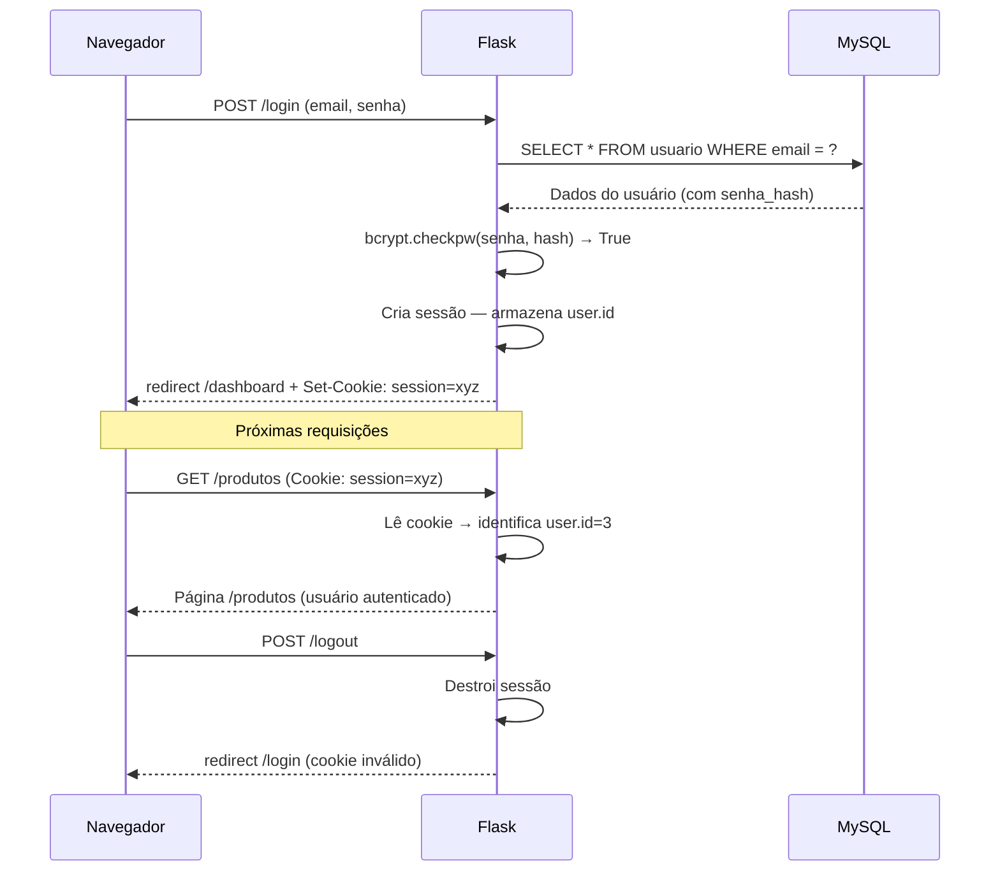

# Aula 14 — Login e Controle de Sessão

> **Disciplina:** Programação para Internet (ILP951)  
> **Professor:** Ronan Adriel Zenatti  
> **Pré-requisitos:** Aula 13 concluída — tabela `usuario` criada, registro com hash bcrypt funcionando.

---

## 🗺️ O que você vai aprender nesta aula

Com o cadastro de usuários pronto, hoje você implementa o sistema de **autenticação completo**: a tela de login que verifica a senha contra o hash, a **sessão** que mantém o usuário identificado entre requisições, e a proteção de rotas que redireciona usuários não autenticados para o login. Você vai usar a biblioteca **Flask-Login** para gerenciar sessões de forma segura e adicionar diferentes níveis de acesso (usuário comum vs. administrador). Ao final, o sistema terá uma fronteira clara entre páginas públicas e páginas protegidas.

---

## Parte 1 — O que é uma sessão e por que ela é necessária

### HTTP é sem memória (stateless)

O HTTP é um protocolo **stateless** — cada requisição é completamente independente das anteriores. O servidor não tem, por padrão, como saber se a requisição que chegou agora vem da mesma pessoa que fez login há três minutos. Sem algum mecanismo de estado, o usuário precisaria se autenticar a cada clique.

A solução são as **sessões**: após o login bem-sucedido, o servidor armazena informações do usuário em um armazenamento temporário e envia ao navegador um **cookie de sessão** — um identificador único e criptografado. A cada requisição subsequente, o navegador reenvia esse cookie automaticamente, e o servidor usa o identificador para recuperar os dados da sessão e identificar quem está fazendo a requisição.



---

## Parte 2 — Flask-Login: gerenciamento de sessões simplificado

### Instalação e configuração

```
pip install flask-login
pip freeze > requirements.txt
```

O Flask-Login exige que você defina uma classe `User` que representa o usuário logado, um `LoginManager` que coordena a autenticação, e uma função que carrega o usuário do banco pelo ID armazenado na sessão.

```python
# app.py — configuração do Flask-Login

from flask import Flask, render_template, request, flash, redirect, url_for
from flask_login import (
    LoginManager, UserMixin,
    login_user, logout_user, login_required, current_user
)
import bcrypt
from db import execute_query

app = Flask(__name__)
app.secret_key = 'chave-secreta-fatec-2026-troque-em-producao'

# ── Configura o LoginManager ──────────────────────────────────────────
login_manager = LoginManager(app)
# login_view: nome da rota para onde redirecionar usuários não autenticados
login_manager.login_view = 'login'
# login_message: mensagem exibida ao redirecionar para o login
login_manager.login_message = 'Faça login para acessar esta página.'
login_manager.login_message_category = 'warning'


# ── Classe User: representa o usuário logado ──────────────────────────
class User(UserMixin):
    """
    UserMixin fornece implementações padrão para os métodos que
    o Flask-Login precisa: is_authenticated, is_active, get_id, etc.
    Você só precisa definir os atributos específicos do seu usuário.
    """
    def __init__(self, id, nome, email, perfil, ativo):
        self.id     = id
        self.nome   = nome
        self.email  = email
        self.perfil = perfil
        self.ativo  = ativo

    def get_id(self):
        # Flask-Login chama este método para obter o identificador
        # que será armazenado na sessão
        return str(self.id)


# ── Carregador de usuário ─────────────────────────────────────────────
@login_manager.user_loader
def load_user(user_id):
    """
    Chamado automaticamente pelo Flask-Login a cada requisição
    para reconstruir o objeto User a partir do ID na sessão.
    Deve retornar None se o usuário não existir (sessão inválida).
    """
    resultado = execute_query(
        'SELECT * FROM usuario WHERE id = %s AND ativo = 1',
        (int(user_id),), fetch=True
    )
    if not resultado:
        return None

    u = resultado[0]
    return User(
        id=u['id'], nome=u['nome'],
        email=u['email'], perfil=u['perfil'], ativo=u['ativo']
    )
```

---

## Parte 3 — Tela de login

### Exemplo prático 1 — Rota de login com verificação bcrypt

```python
@app.route('/login', methods=['GET', 'POST'])
def login():
    # Se o usuário já está logado, redireciona para o início
    if current_user.is_authenticated:
        return redirect(url_for('pagina_inicial'))

    if request.method == 'POST':
        email  = request.form.get('email', '').strip().lower()
        senha  = request.form.get('senha', '')
        lembrar = request.form.get('lembrar') == 'sim'
        # lembrar: mantém o cookie de sessão após fechar o navegador

        # ── Busca o usuário pelo e-mail ──────────────────────────────
        resultado = execute_query(
            'SELECT * FROM usuario WHERE email = %s',
            (email,), fetch=True
        )

        if not resultado:
            # Mensagem genérica — não revela se o e-mail existe ou não
            # Revelar qual dos dois está errado ajuda atacantes
            flash('E-mail ou senha incorretos.', 'danger')
            return render_template('login.html', email=email)

        usuario = resultado[0]

        # ── Verifica se a conta está ativa ───────────────────────────
        if not usuario['ativo']:
            flash('Esta conta está desativada. Contate o administrador.', 'warning')
            return render_template('login.html', email=email)

        # ── Verifica a senha contra o hash ───────────────────────────
        senha_valida = bcrypt.checkpw(
            senha.encode('utf-8'),
            usuario['senha_hash'].encode('utf-8')
        )

        if not senha_valida:
            flash('E-mail ou senha incorretos.', 'danger')
            return render_template('login.html', email=email)

        # ── Login bem-sucedido ───────────────────────────────────────
        # Cria o objeto User e inicia a sessão
        user_obj = User(
            id=usuario['id'], nome=usuario['nome'],
            email=usuario['email'], perfil=usuario['perfil'],
            ativo=usuario['ativo']
        )
        login_user(user_obj, remember=lembrar)
        # remember=True: o cookie persiste após fechar o navegador

        # Atualiza o timestamp de último login
        execute_query(
            'UPDATE usuario SET ultimo_login = NOW() WHERE id = %s',
            (usuario['id'],)
        )

        flash(f'Bem-vindo(a), {usuario["nome"]}!', 'success')

        # Redireciona para a página que o usuário tentou acessar antes
        # (Flask-Login armazena isso automaticamente no parâmetro 'next')
        next_page = request.args.get('next')
        return redirect(next_page or url_for('pagina_inicial'))

    return render_template('login.html')
```

### Exemplo prático 2 — Template de login

```html

Login


<div class="row justify-content-center mt-4">
  <div class="col-md-5 col-lg-4">
    <div class="card shadow">

      <div class="card-header bg-dark text-white text-center py-3">
        <h4 class="mb-0">🔑 Entrar no Sistema</h4>
      </div>

      <div class="card-body p-4">
        <form action="{{ url_for('login') }}" method="post">

          <div class="mb-3">
            <label for="email" class="form-label">E-mail</label>
            <input type="email" class="form-control" id="email" name="email"
                   value="{{ email | default('') }}"
                   required autofocus placeholder="seu@email.com">
            {# autofocus: cursor posicionado neste campo ao abrir a página #}
          </div>

          <div class="mb-3">
            <label for="senha" class="form-label">Senha</label>
            <div class="input-group">
              <input type="password" class="form-control" id="senha" name="senha"
                     required placeholder="Sua senha">
              {# Botão para mostrar/ocultar a senha #}
              <button class="btn btn-outline-secondary" type="button"
                      onclick="toggleSenha()">👁️</button>
            </div>
          </div>

          <div class="mb-3 form-check">
            <input type="checkbox" class="form-check-input"
                   id="lembrar" name="lembrar" value="sim">
            <label class="form-check-label" for="lembrar">
              Manter conectado
            </label>
          </div>

          <button type="submit" class="btn btn-dark w-100 py-2">
            Entrar →
          </button>

        </form>

        <hr class="my-3">
        <p class="text-center small mb-0">
          Não tem conta?
          <a href="{{ url_for('registro') }}">Criar conta →</a>
        </p>
      </div>
    </div>
  </div>
</div>



<script>
function toggleSenha() {
    const campo = document.getElementById('senha');
    campo.type = campo.type === 'password' ? 'text' : 'password';
}
</script>

```

---

## Parte 4 — Logout e proteção de rotas

### Logout

```python
@app.route('/logout')
@login_required  # só quem está logado pode fazer logout
def logout():
    nome = current_user.nome  # captura antes de destruir a sessão
    logout_user()             # Flask-Login destrói a sessão
    flash(f'Até logo, {nome}!', 'info')
    return redirect(url_for('login'))
```

### Protegendo rotas com @login_required

O decorador `@login_required` do Flask-Login é a forma mais simples e direta de proteger uma rota. Se um usuário não autenticado tentar acessá-la, é redirecionado para `login_manager.login_view` com uma mensagem automática:

```python
@app.route('/produtos')
@login_required   # ← adicione este decorador em todas as rotas protegidas
def lista_produtos():
    produtos = execute_query('SELECT * FROM produto WHERE ativo=1', fetch=True)
    return render_template('produtos.html', produtos=produtos, total=len(produtos))


@app.route('/admin/usuarios')
@login_required
def admin_usuarios():
    # Verificação extra de perfil: apenas admins
    if current_user.perfil != 'admin':
        flash('Acesso restrito a administradores.', 'danger')
        return redirect(url_for('pagina_inicial'))

    usuarios = execute_query('SELECT * FROM usuario ORDER BY nome', fetch=True)
    return render_template('admin_usuarios.html', usuarios=usuarios)
```

### Atualizando o template base com menu dinâmico

O `base.html` precisa mostrar itens de menu diferentes conforme o estado de autenticação. O `current_user` fica disponível automaticamente em todos os templates:

```html
{# Em templates/base.html, dentro da navbar #}
<div class="collapse navbar-collapse" id="navbarNav">
  <ul class="navbar-nav ms-auto">

    {# Itens visíveis para todos #}
    <li class="nav-item">
      <a class="nav-link" href="{{ url_for('pagina_inicial') }}">Início</a>
    </li>

    {# Itens apenas para usuários autenticados #}
    
      <li class="nav-item">
        <a class="nav-link" href="{{ url_for('lista_produtos') }}">Produtos</a>
      </li>

      {# Item apenas para administradores #}
      
        <li class="nav-item dropdown">
          <a class="nav-link dropdown-toggle" href="#"
             data-bs-toggle="dropdown">⚙️ Admin</a>
          <ul class="dropdown-menu dropdown-menu-end">
            <li>
              <a class="dropdown-item" href="{{ url_for('admin_usuarios') }}">
                👥 Usuários
              </a>
            </li>
          </ul>
        </li>
      

      {# Menu do usuário logado #}
      <li class="nav-item dropdown">
        <a class="nav-link dropdown-toggle" href="#" data-bs-toggle="dropdown">
          👤 {{ current_user.nome.split()[0] }}
          {# .split()[0]: mostra apenas o primeiro nome #}
        </a>
        <ul class="dropdown-menu dropdown-menu-end">
          <li>
            <span class="dropdown-item-text text-muted small">
              {{ current_user.email }}
            </span>
          </li>
          <li><hr class="dropdown-divider"></li>
          <li>
            <a class="dropdown-item text-danger" href="{{ url_for('logout') }}">
              🚪 Sair
            </a>
          </li>
        </ul>
      </li>

    
      {# Para usuários não autenticados: links de login e registro #}
      <li class="nav-item">
        <a class="nav-link" href="{{ url_for('login') }}">🔑 Entrar</a>
      </li>
      <li class="nav-item">
        <a class="nav-link" href="{{ url_for('registro') }}">📝 Cadastrar</a>
      </li>
    

  </ul>
</div>
```

[Captura de tela ilustrativa mostrando a navbar do sistema em dois estados lado a lado. Estado esquerdo "Não autenticado": navbar escura com logo "SistemaGestão" à esquerda e links "🔑 Entrar" e "📝 Cadastrar" à direita. Estado direito "Autenticado como admin": navbar escura com logo à esquerda, links "Início", "Produtos", menu dropdown "⚙️ Admin" e menu dropdown "👤 João" com opções "joao@fatec.br (cinza)", linha divisória e "🚪 Sair" em vermelho. Seta entre os dois estados rotulada "Após login bem-sucedido". Fundo Bootstrap escuro, estilo screenshot educacional realista.]


---

## Parte 5 — Criando o usuário administrador inicial

Para que o sistema funcione, é necessário ter pelo menos um usuário no banco. Adicione ao `db_setup.py` a criação do admin padrão:

```python
import bcrypt

# Cria o usuário admin padrão se não existir
cursor.execute('SELECT id FROM usuario WHERE email = %s', ('admin@sistema.com',))
if not cursor.fetchone():
    senha_admin = bcrypt.hashpw(
        'Admin@123'.encode('utf-8'), bcrypt.gensalt()
    ).decode('utf-8')
    cursor.execute(
        '''INSERT INTO usuario (nome, email, senha_hash, perfil)
           VALUES (%s, %s, %s, 'admin')''',
        ('Administrador', 'admin@sistema.com', senha_admin)
    )
    conn.commit()
    print('✅ Usuário admin criado: admin@sistema.com / Admin@123')
    print('⚠️  ALTERE A SENHA DO ADMIN APÓS O PRIMEIRO LOGIN!')
```

---

## Atividade da Aula

Implemente o sistema completo de autenticação: configure `LoginManager` e a classe `User`, crie as rotas `/login` e `/logout`, adicione `@login_required` em todas as rotas que exigem autenticação, e atualize o `base.html` com a navbar dinâmica. Crie o usuário admin via `db_setup.py` e teste o ciclo completo: registrar novo usuário, fazer login, navegar por páginas protegidas, e fazer logout. Teste também o acesso direto a uma rota protegida sem login — o sistema deve redirecionar para o login e retornar para a página após autenticação.

```
git add .
git commit -m "Aula 14: login, sessão e proteção de rotas com Flask-Login"
git push
```

---

## Resumo da Aula

O sistema ganhou autenticação completa. Você configurou o Flask-Login com `LoginManager` e a classe `User(UserMixin)`, implementou o login com verificação bcrypt e tratamento de conta inativa, e o logout que destrói a sessão. Protegeu as rotas com `@login_required` e adicionou verificação de perfil para rotas administrativas. O `base.html` agora exibe menus diferentes conforme o estado de autenticação usando `current_user`. Na próxima aula, você adiciona os relatórios gerenciais — o último pilar funcional antes da entrega do T2.

---

> ⬅️ [Aula anterior: Segurança e Registro](Aula_13_Seguranca_e_Registro.md) | ➡️ [Próxima Aula: Relatórios Gerenciais](Aula_15_Relatorios_Gerenciais.md)
