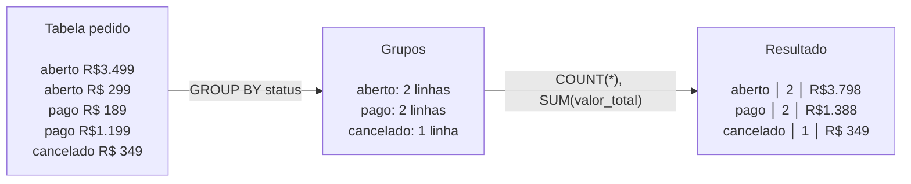

# Aula 15 — Relatórios Gerenciais

> **Disciplina:** Programação para Internet (ILP951)  
> **Professor:** Ronan Adriel Zenatti  
> **Pré-requisitos:** Aula 14 concluída — autenticação com Flask-Login funcionando.

---

## 🗺️ O que você vai aprender nesta aula

Um sistema que apenas armazena dados tem valor limitado. O verdadeiro valor está em **transformar dados em informação para tomada de decisão**. Hoje você vai construir os relatórios gerenciais do sistema: consultas SQL com funções de agregação (`COUNT`, `SUM`, `AVG`, `GROUP BY`), um dashboard com cartões de resumo executivo, gráficos interativos com **Chart.js** alimentados por dados reais do banco, e relatórios filtráveis por período. Essas são as funcionalidades que diferenciam um sistema de gestão de uma simples planilha.

---

## Parte 1 — Funções de agregação no SQL

### Da listagem ao resumo

As queries que fizemos até aqui buscavam linhas individuais — `SELECT * FROM produto WHERE id = 5`. As funções de agregação operam sobre **conjuntos de linhas** e retornam um único valor de resumo. São a base de qualquer relatório gerencial.

As funções mais usadas são cinco. `COUNT(coluna)` conta quantas linhas têm valor não-nulo nessa coluna; `COUNT(*)` conta todas as linhas. `SUM(coluna)` soma os valores numéricos. `AVG(coluna)` calcula a média. `MIN(coluna)` e `MAX(coluna)` retornam o menor e o maior valor.

```sql
-- Resumo geral do sistema
SELECT
    COUNT(*)                          AS total_produtos,
    COUNT(CASE WHEN ativo=1 THEN 1 END) AS produtos_ativos,
    SUM(estoque)                      AS total_em_estoque,
    ROUND(AVG(preco), 2)              AS preco_medio,
    MIN(preco)                        AS menor_preco,
    MAX(preco)                        AS maior_preco
FROM produto;
```

O `GROUP BY` é onde a agregação fica poderosa: em vez de um único número para a tabela toda, ele agrupa os dados por uma coluna e aplica a agregação a cada grupo separadamente.

```sql
-- Quantidade e valor por status de pedido
SELECT
    status,
    COUNT(*)            AS quantidade,
    SUM(valor_total)    AS valor_total,
    ROUND(AVG(valor_total), 2) AS ticket_medio
FROM pedido
GROUP BY status
ORDER BY quantidade DESC;
```



### HAVING: filtrando grupos

Enquanto `WHERE` filtra linhas antes da agregação, `HAVING` filtra grupos **após** a agregação. Use `HAVING` sempre que a condição envolve o resultado de uma função de agregação:

```sql
-- Clientes que gastaram mais de R$ 1.000
SELECT
    c.nome,
    COUNT(p.id)        AS total_pedidos,
    SUM(p.valor_total) AS total_gasto
FROM cliente c
LEFT JOIN pedido p ON p.cliente_id = c.id
GROUP BY c.id, c.nome
HAVING SUM(p.valor_total) > 1000
ORDER BY total_gasto DESC;
```

---

## Parte 2 — Dashboard executivo

### Exemplo prático 1 — Rota do dashboard com múltiplas métricas

```python
@app.route('/dashboard')
@login_required
def dashboard():
    # ── KPIs de produtos ──────────────────────────────────────────────
    kpi_produtos = execute_query('''
        SELECT
            COUNT(*)                              AS total,
            COUNT(CASE WHEN ativo=1 THEN 1 END)   AS ativos,
            COUNT(CASE WHEN estoque=0 THEN 1 END)  AS sem_estoque,
            ROUND(AVG(preco), 2)                   AS preco_medio
        FROM produto
    ''', fetch=True)[0]

    # ── KPIs de pedidos ───────────────────────────────────────────────
    kpi_pedidos = execute_query('''
        SELECT
            COUNT(*)                                       AS total,
            COUNT(CASE WHEN status='aberto' THEN 1 END)    AS abertos,
            COUNT(CASE WHEN status='pago' THEN 1 END)      AS pagos,
            COALESCE(SUM(valor_total), 0)                  AS faturamento
        FROM pedido
    ''', fetch=True)[0]

    # ── Pedidos por status (para gráfico de pizza) ────────────────────
    pedidos_por_status = execute_query('''
        SELECT status, COUNT(*) AS quantidade
        FROM pedido
        GROUP BY status
    ''', fetch=True)

    # ── Faturamento por dia (últimos 30 dias) — para gráfico de linha ─
    faturamento_diario = execute_query('''
        SELECT
            DATE(criado_em)  AS dia,
            SUM(valor_total) AS total
        FROM pedido
        WHERE status = 'pago'
          AND criado_em >= DATE_SUB(NOW(), INTERVAL 30 DAY)
        GROUP BY DATE(criado_em)
        ORDER BY dia
    ''', fetch=True)

    # ── Top 5 produtos mais caros ─────────────────────────────────────
    top_produtos = execute_query('''
        SELECT nome, preco, estoque
        FROM produto
        WHERE ativo = 1
        ORDER BY preco DESC
        LIMIT 5
    ''', fetch=True)

    return render_template('dashboard.html',
                           kpi_produtos=kpi_produtos,
                           kpi_pedidos=kpi_pedidos,
                           pedidos_por_status=pedidos_por_status,
                           faturamento_diario=faturamento_diario,
                           top_produtos=top_produtos)
```

### Template do dashboard

```html

Dashboard


<div class="d-flex justify-content-between align-items-center mb-4">
  <h2>📊 Dashboard Gerencial</h2>
  <small class="text-muted">Dados em tempo real</small>
</div>

{# ── Linha de KPIs ────────────────────────────────────────────── #}
<div class="row mb-4">

  <div class="col-6 col-md-3 mb-3">
    <div class="card border-0 bg-primary text-white h-100">
      <div class="card-body text-center">
        <div class="display-5 fw-bold">{{ kpi_produtos.total }}</div>
        <div class="small opacity-75">Produtos</div>
        <div class="small mt-1">
          {{ kpi_produtos.ativos }} ativos
        </div>
      </div>
    </div>
  </div>

  <div class="col-6 col-md-3 mb-3">
    <div class="card border-0 bg-success text-white h-100">
      <div class="card-body text-center">
        <div class="display-5 fw-bold">{{ kpi_pedidos.total }}</div>
        <div class="small opacity-75">Pedidos</div>
        <div class="small mt-1">
          {{ kpi_pedidos.abertos }} em aberto
        </div>
      </div>
    </div>
  </div>

  <div class="col-6 col-md-3 mb-3">
    <div class="card border-0 bg-warning text-dark h-100">
      <div class="card-body text-center">
        <div class="display-5 fw-bold">{{ kpi_produtos.sem_estoque }}</div>
        <div class="small opacity-75">Sem Estoque</div>
        <div class="small mt-1">precisam reposição</div>
      </div>
    </div>
  </div>

  <div class="col-6 col-md-3 mb-3">
    <div class="card border-0 bg-info text-white h-100">
      <div class="card-body text-center">
        <div class="display-5 fw-bold">
          R$ {{ "%.0f"|format(kpi_pedidos.faturamento) }}
        </div>
        <div class="small opacity-75">Faturamento</div>
        <div class="small mt-1">pedidos pagos</div>
      </div>
    </div>
  </div>

</div>

{# ── Linha de Gráficos ─────────────────────────────────────────── #}
<div class="row mb-4">

  {# Gráfico de pizza — pedidos por status #}
  <div class="col-md-4 mb-3">
    <div class="card h-100">
      <div class="card-header bg-light">🥧 Pedidos por Status</div>
      <div class="card-body d-flex justify-content-center align-items-center">
        <canvas id="graficoPizza" style="max-height:220px"></canvas>
      </div>
    </div>
  </div>

  {# Gráfico de linha — faturamento últimos 30 dias #}
  <div class="col-md-8 mb-3">
    <div class="card h-100">
      <div class="card-header bg-light">📈 Faturamento — Últimos 30 Dias</div>
      <div class="card-body">
        <canvas id="graficoLinha" style="max-height:220px"></canvas>
      </div>
    </div>
  </div>

</div>

{# ── Top produtos ──────────────────────────────────────────────── #}
<div class="card">
  <div class="card-header bg-light">🏆 Top 5 Produtos por Preço</div>
  <div class="card-body p-0">
    <table class="table table-sm mb-0">
      <thead class="table-light">
        <tr><th>Produto</th><th>Preço</th><th>Estoque</th></tr>
      </thead>
      <tbody>
        
        <tr>
          <td>{{ p.nome }}</td>
          <td class="fw-bold text-success">R$ {{ "%.2f"|format(p.preco) }}</td>
          <td>
            
              <span class="badge bg-danger">Esgotado</span>
            
              <span class="badge bg-warning text-dark">{{ p.estoque }}</span>
            
              <span class="badge bg-success">{{ p.estoque }}</span>
            
          </td>
        </tr>
        
      </tbody>
    </table>
  </div>
</div>




{# Chart.js via CDN — biblioteca de gráficos JavaScript #}
<script src="https://cdn.jsdelivr.net/npm/chart.js@4.4.0/dist/chart.umd.min.js"></script>
<script>
// ── Dados passados do Python para o JavaScript via Jinja2 ────────────────
// tojson: filtro Jinja2 que serializa variáveis Python para JSON válido no JS
const statusLabels  = {{ pedidos_por_status | map(attribute='status')     | list | tojson }};
const statusDados   = {{ pedidos_por_status | map(attribute='quantidade')  | list | tojson }};
const diasLabels    = {{ faturamento_diario  | map(attribute='dia')        | list | tojson }};
const diasDados     = {{ faturamento_diario  | map(attribute='total')      | list | tojson }};

// ── Gráfico de pizza: pedidos por status ────────────────────────────────
new Chart(document.getElementById('graficoPizza'), {
    type: 'doughnut',
    data: {
        labels: statusLabels,
        datasets: [{
            data: statusDados,
            backgroundColor: ['#0d6efd', '#198754', '#dc3545'],
            borderWidth: 2,
            borderColor: '#fff'
        }]
    },
    options: {
        responsive: true,
        plugins: {
            legend: { position: 'bottom' }
        }
    }
});

// ── Gráfico de linha: faturamento diário ────────────────────────────────
new Chart(document.getElementById('graficoLinha'), {
    type: 'line',
    data: {
        labels: diasLabels,
        datasets: [{
            label: 'Faturamento (R$)',
            data: diasDados,
            borderColor: '#198754',
            backgroundColor: 'rgba(25, 135, 84, 0.1)',
            tension: 0.3,   // suaviza a curva da linha
            fill: true
        }]
    },
    options: {
        responsive: true,
        scales: {
            y: { beginAtZero: true }
        },
        plugins: {
            legend: { display: false }
        }
    }
});
</script>

```

[Captura de tela ilustrativa do dashboard gerencial renderizado no navegador. Título "📊 Dashboard Gerencial" com "Dados em tempo real" à direita. Linha de quatro cards coloridos: "12 Produtos — 10 ativos" (azul), "8 Pedidos — 3 em aberto" (verde), "2 Sem Estoque — precisam reposição" (amarelo), "R$ 8.340 Faturamento — pedidos pagos" (azul claro). Abaixo, dois gráficos lado a lado: gráfico de rosca "Pedidos por Status" com fatias azul/verde/vermelha e legenda, e gráfico de linha "Faturamento Últimos 30 Dias" com curva verde suave sobre área sombreada. Abaixo, tabela "Top 5 Produtos por Preço" com cinco linhas. Estilo screenshot Bootstrap realista.]


---

## Parte 3 — Relatório filtrado por período

### Exemplo prático 2 — Relatório de pedidos com filtro de data

```python
@app.route('/relatorios/pedidos')
@login_required
def relatorio_pedidos():
    from datetime import datetime, timedelta

    # Filtros de data (padrão: últimos 30 dias)
    data_inicio = request.args.get('data_inicio',
        (datetime.now() - timedelta(days=30)).strftime('%Y-%m-%d'))
    data_fim = request.args.get('data_fim',
        datetime.now().strftime('%Y-%m-%d'))
    status_filtro = request.args.get('status', 'todos')

    sql = '''
        SELECT
            p.id,
            p.valor_total,
            p.status,
            DATE(p.criado_em) AS data_pedido,
            c.nome            AS cliente_nome
        FROM pedido p
        INNER JOIN cliente c ON p.cliente_id = c.id
        WHERE DATE(p.criado_em) BETWEEN %s AND %s
    '''
    params = [data_inicio, data_fim]

    if status_filtro != 'todos':
        sql += ' AND p.status = %s'
        params.append(status_filtro)

    sql += ' ORDER BY p.criado_em DESC'

    pedidos = execute_query(sql, params, fetch=True)

    # Totalizadores calculados em Python
    total_geral  = sum(float(p['valor_total']) for p in pedidos)
    total_pagos  = sum(float(p['valor_total']) for p in pedidos
                       if p['status'] == 'pago')

    return render_template('relatorio_pedidos.html',
                           pedidos=pedidos,
                           total_geral=total_geral,
                           total_pagos=total_pagos,
                           data_inicio=data_inicio,
                           data_fim=data_fim,
                           status_filtro=status_filtro)
```

### Exemplo prático 3 — Relatório de estoque crítico

```python
@app.route('/relatorios/estoque')
@login_required
def relatorio_estoque():
    limite = int(request.args.get('limite', 5))

    estoque_critico = execute_query('''
        SELECT nome, preco, estoque,
               (preco * estoque) AS valor_em_estoque
        FROM produto
        WHERE ativo = 1 AND estoque <= %s
        ORDER BY estoque ASC, nome
    ''', (limite,), fetch=True)

    # Valor total em risco (estoque baixo)
    valor_em_risco = sum(
        float(p['valor_em_estoque']) for p in estoque_critico
    )

    return render_template('relatorio_estoque.html',
                           produtos=estoque_critico,
                           valor_em_risco=valor_em_risco,
                           limite=limite)
```

---

## Atividade da Aula

Implemente o dashboard para o seu sistema com pelo menos quatro KPIs relevantes para o seu domínio (contagens, somas, médias). Adicione um gráfico de pizza ou rosca para alguma distribuição categórica (por status, por categoria, por cidade) e um gráfico de barras ou linha para evolução temporal. Crie um relatório filtrado por data para a entidade principal. Certifique-se de que todas as rotas estão protegidas com `@login_required`.

```
git add .
git commit -m "Aula 15: dashboard com KPIs, gráficos Chart.js e relatórios filtrados"
git push
```

---

## Resumo da Aula

Hoje o sistema ganhou inteligência gerencial. Você dominou as funções de agregação SQL (`COUNT`, `SUM`, `AVG`, `GROUP BY`, `HAVING`) e as usou para construir KPIs reais. Integrou o Chart.js passando dados Python → Jinja2 → JSON → JavaScript para gráficos interativos. Construiu relatórios filtráveis por período com `BETWEEN` e totalizadores calculados no servidor. Com isso, o sistema tem todas as funcionalidades necessárias para o T2.

---

> ⬅️ [Aula anterior: Login e Controle de Sessão](Aula_14_Login_e_Controle_de_Sessao.md) | ➡️ [Próxima Aula: Desenvolvimento Interdisciplinar](Aula_16_Desenvolvimento_Interdisciplinar.md)
